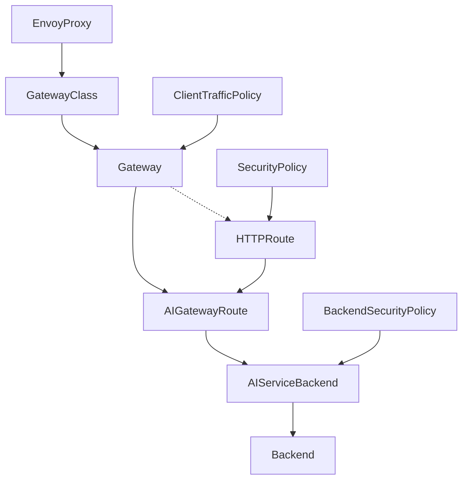

:::caution
This page contains administrative documentation intended for cluster administrators and operators. This content may not be relevant for regular users.
:::

## Overview

This document describes the steps to configure the [Envoy AI Gateway](https://aigateway.envoyproxy.io).



## Gitlab Project

The (hopefully) current configuration is in https://gitlab.nrp-nautilus.io/prp/llm-proxy project. You most likely will only need to edit the stuff in models-config folder. Everything else is either other experiments or core config that doesn't have to change.

:::caution
The CRDs are pretty complex. Instead of directly editing the cluster objects, please edit the local files and do `kubectl apply -f <file>` after examining the changes to be made (`kubectl diff -f <file>`). This will ensure your local content is the same as remote.
:::

Push back your changes to git when you're done.

Since we need to handle objects deletions too, we can't add those to GitLab CI/CD yet.

## CRDs Structure

### AIGatewayRoute

The top object is [AIGatewayRoute](https://aigateway.envoyproxy.io/docs/api/#aigatewayroute), referencing the `Gateway` that you don't need to change.

Current AIGatewayRoutes are in https://gitlab.nrp-nautilus.io/prp/llm-proxy/-/tree/main/models-config/gatewayroute, and are split into several objects because there's a limit of 16 routes (rules) per object. Start from adding your new model as a new rule. Note that we're overriding the long names of the models with shorter ones using the [modelNameOverride feature](https://aigateway.envoyproxy.io/blog/v0.3-release-announcement#model-name-virtualization-abstraction-for-flexibility).

On this level, you can also set up load-balancing between multiple models. Having several [backendRefs](https://aigateway.envoyproxy.io/docs/api/#aigatewayrouterulebackendref) will make Envoy round-robin between those. There's also a way to set priority and fallbacks (which currently [have a regression](https://github.com/envoyproxy/ai-gateway/pull/1322)).

**Make sure to delete the `rules:` and update the `AIGatewayRoute` with `kubectl apply -f <file>` if a model is removed. If all models under `rules:` were deleted, make sure to delete the `AIGatewayRoute` resource manually.**

Example (under https://gitlab.nrp-nautilus.io/prp/llm-proxy/-/tree/main/models-config/gatewayroute):

```yaml
apiVersion: aigateway.envoyproxy.io/v1alpha1
kind: AIGatewayRoute
metadata:
  name: envoy-ai-gateway-nrp-qwen
  namespace: nrp-llm
spec:
  llmRequestCosts:
    - metadataKey: llm_input_token
      type: InputToken    # Counts tokens in the request
    - metadataKey: llm_output_token
      type: OutputToken   # Counts tokens in the response
    - metadataKey: llm_total_token
      type: TotalToken   # Tracks combined usage
  parentRefs:
    - name: envoy-ai-gateway-nrp
      kind: Gateway
      group: gateway.networking.k8s.io
  rules:
    - matches:
        - headers:
            - type: Exact
              name: x-ai-eg-model
              value: qwen3
      backendRefs:
        - name: envoy-ai-gateway-nrp-qwen
          modelNameOverride: Qwen/Qwen3-235B-A22B-Thinking-2507-FP8
      timeouts:
        request: 1200s
      modelsOwnedBy: "NRP"
    - matches:
        - headers:
            - type: Exact
              name: x-ai-eg-model
              value: qwen3-nairr
      backendRefs:
        - name: envoy-ai-gateway-sdsc-nairr-qwen3
          modelNameOverride: Qwen/Qwen3-235B-A22B-Thinking-2507-FP8
      timeouts:
        request: 1200s
      modelsOwnedBy: "SDSC"
    # Multiple backendRefs do round-robin
    - matches:
        - headers:
            - type: Exact
              name: x-ai-eg-model
              value: qwen3-combined
      backendRefs:
        - name: envoy-ai-gateway-nrp-qwen
          modelNameOverride: Qwen/Qwen3-235B-A22B-Thinking-2507-FP8
        - name: envoy-ai-gateway-sdsc-nairr-qwen3
          modelNameOverride: Qwen/Qwen3-235B-A22B-Thinking-2507-FP8
      timeouts:
        request: 1200s
      modelsOwnedBy: "NRP"
```

Start defining the [AIServiceBackend](https://aigateway.envoyproxy.io/docs/api/#aiservicebackend) next.

### AIServiceBackend

Add your [AIServiceBackend](https://aigateway.envoyproxy.io/docs/api/#aiservicebackend) to one of the files in https://gitlab.nrp-nautilus.io/prp/llm-proxy/-/tree/main/models-config/servicebackend.

**Make sure to delete the `AIServiceBackend` resource manually if a model is removed.**

Example (under https://gitlab.nrp-nautilus.io/prp/llm-proxy/-/tree/main/models-config/servicebackend):

```yaml
apiVersion: aigateway.envoyproxy.io/v1alpha1
kind: AIServiceBackend
metadata:
  name: envoy-ai-gateway-nrp-qwen
  namespace: nrp-llm
spec:
  schema:
    name: OpenAI
  backendRef:
    name: envoy-ai-gateway-nrp-qwen
    kind: Backend
    group: gateway.envoyproxy.io
```

Continue to defining the [Backend](https://gateway.envoyproxy.io/docs/api/extension_types/#backend).

### Backend

:::note
This object belongs to the Envoy Gateway API and not Envoy AI Gateway API.
:::

Add your [Backend](https://gateway.envoyproxy.io/docs/api/extension_types/#backend) to one of the files in https://gitlab.nrp-nautilus.io/prp/llm-proxy/-/tree/main/models-config/backend.

You can point it to a URL (either a service inside the cluster or a FQDN), or an IP.

**Make sure to delete the `Backend` resource manually if a model is removed.**

Example (under https://gitlab.nrp-nautilus.io/prp/llm-proxy/-/tree/main/models-config/backend):

```yaml
apiVersion: gateway.envoyproxy.io/v1alpha1
kind: Backend
metadata:
  name: envoy-ai-gateway-nrp-qwen
  namespace: nrp-llm
spec:
  endpoints:
    - fqdn:
        hostname: qwen-vllm-inference.nrp-llm.svc.cluster.local
        port: 5000
```

### BackendSecurityPolicy

If your model has a newly added API access key, you can add a [BackendSecurityPolicy](https://aigateway.envoyproxy.io/docs/api/#backendsecuritypolicy) to https://gitlab.nrp-nautilus.io/prp/llm-proxy/-/blob/main/models-config/securitypolicy.yaml. It will point to an existing secret in the cluster containing your ApiKey.

It's easier if you reuse one of existing keys and simply add your backend to the list in one of existing BackendSecurityPolicies. The `BackendSecurityPolicy` should target an existing AIServiceBackend.

**Make sure to delete the `targetRefs:` section and update the `BackendSecurityPolicy` with `kubectl apply -f <file>` if a model is removed. Make sure to delete the `BackendSecurityPolicy` resource manually if all models under `targetRefs:` are removed.**

Example (under https://gitlab.nrp-nautilus.io/prp/llm-proxy/-/blob/main/models-config/securitypolicy.yaml):

```yaml
apiVersion: aigateway.envoyproxy.io/v1alpha1
kind: BackendSecurityPolicy
metadata:
  name: envoy-ai-gateway-nrp-apikey
  namespace: nrp-llm
spec:
  type: APIKey
  apiKey:
    secretRef:
      name: openai-apikey
      namespace: nrp-llm
  targetRefs:
    - name: envoy-ai-gateway-nrp-qwen
      kind: AIServiceBackend
      group: aigateway.envoyproxy.io
```
