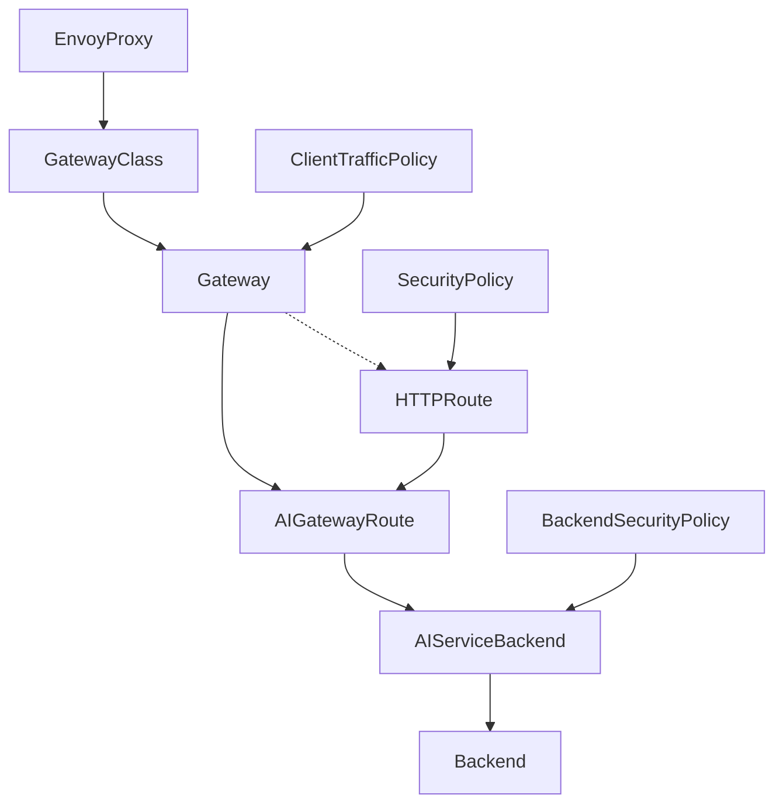

:::caution
This page contains administrative documentation intended for cluster administrators and operators. This content may not be relevant for regular users.
:::

:::caution
When changing the provided models, also change the [Chatbox config template](https://gitlab.nrp-nautilus.io/prp/nrp-site/-/blob/main/src/components/vue/LLMToken.vue).
:::


## Envoy AI Gateway Management

This document describes the steps to configure the [Envoy AI Gateway](https://aigateway.envoyproxy.io).



## Gitlab Project

The (hopefully) current configuration is in https://gitlab.nrp-nautilus.io/prp/llm-proxy project. You most likely will only need to edit the stuff in models-config folder. Everything else is either other experiments or core config that doesn't have to change.

:::caution
The CRDs are pretty complex. Instead of directly editing the cluster objects, please edit the local files and do `kubectl apply -f <file>` after examining the changes to be made (`kubectl diff -f <file>`). This will ensure your local content is the same as remote.
:::

Push back your changes to git when you're done.

Since we need to handle objects deletions too, we can't add those to GitLab CI/CD yet.

## CRDs Structure

### AIGatewayRoute

The top object is [AIGatewayRoute](https://aigateway.envoyproxy.io/docs/api/#aigatewayroute), referencing the `Gateway` that you don't need to change.

Current AIGatewayRoutes are in https://gitlab.nrp-nautilus.io/prp/llm-proxy/-/tree/main/models-config/gatewayroute, and are split into several objects because there's a limit of 16 routes (rules) per object. Start from adding your new model as a new rule. Note that we're overriding the long names of the models with shorter ones using the [modelNameOverride feature](https://aigateway.envoyproxy.io/blog/v0.3-release-announcement#model-name-virtualization-abstraction-for-flexibility).

On this level, you can also set up load-balancing between multiple models. Having several [backendRefs](https://aigateway.envoyproxy.io/docs/api/#aigatewayrouterulebackendref) will make Envoy round-robin between those. There's also a way to set priority and fallbacks (which currently [have a regression](https://github.com/envoyproxy/ai-gateway/pull/1322)).

**Make sure to delete the `rules:` and update the `AIGatewayRoute` with `kubectl apply -f <file>` if a model is removed. If all models under `rules:` were deleted, make sure to delete the `AIGatewayRoute` resource manually.**

Example (under https://gitlab.nrp-nautilus.io/prp/llm-proxy/-/tree/main/models-config/gatewayroute):

```yaml
apiVersion: aigateway.envoyproxy.io/v1alpha1
kind: AIGatewayRoute
metadata:
  name: envoy-ai-gateway-nrp-qwen
  namespace: nrp-llm
spec:
  llmRequestCosts:
    - metadataKey: llm_input_token
      type: InputToken    # Counts tokens in the request
    - metadataKey: llm_output_token
      type: OutputToken   # Counts tokens in the response
    - metadataKey: llm_total_token
      type: TotalToken   # Tracks combined usage
  parentRefs:
    - name: envoy-ai-gateway-nrp
      kind: Gateway
      group: gateway.networking.k8s.io
  rules:
    - matches:
        - headers:
            - type: Exact
              name: x-ai-eg-model
              value: qwen3
      backendRefs:
        - name: envoy-ai-gateway-nrp-qwen
          modelNameOverride: Qwen/Qwen3-235B-A22B-Thinking-2507-FP8
      timeouts:
        request: 1200s
      modelsOwnedBy: "NRP"
    - matches:
        - headers:
            - type: Exact
              name: x-ai-eg-model
              value: qwen3-nairr
      backendRefs:
        - name: envoy-ai-gateway-sdsc-nairr-qwen3
          modelNameOverride: Qwen/Qwen3-235B-A22B-Thinking-2507-FP8
      timeouts:
        request: 1200s
      modelsOwnedBy: "SDSC"
    # Multiple backendRefs do round-robin
    - matches:
        - headers:
            - type: Exact
              name: x-ai-eg-model
              value: qwen3-combined
      backendRefs:
        - name: envoy-ai-gateway-nrp-qwen
          modelNameOverride: Qwen/Qwen3-235B-A22B-Thinking-2507-FP8
        - name: envoy-ai-gateway-sdsc-nairr-qwen3
          modelNameOverride: Qwen/Qwen3-235B-A22B-Thinking-2507-FP8
      timeouts:
        request: 1200s
      modelsOwnedBy: "NRP"
```

Start defining the [AIServiceBackend](https://aigateway.envoyproxy.io/docs/api/#aiservicebackend) next.

### AIServiceBackend

Add your [AIServiceBackend](https://aigateway.envoyproxy.io/docs/api/#aiservicebackend) to one of the files in https://gitlab.nrp-nautilus.io/prp/llm-proxy/-/tree/main/models-config/servicebackend.

**Make sure to delete the `AIServiceBackend` resource manually if a model is removed.**

Example (under https://gitlab.nrp-nautilus.io/prp/llm-proxy/-/tree/main/models-config/servicebackend):

```yaml
apiVersion: aigateway.envoyproxy.io/v1alpha1
kind: AIServiceBackend
metadata:
  name: envoy-ai-gateway-nrp-qwen
  namespace: nrp-llm
spec:
  schema:
    name: OpenAI
  backendRef:
    name: envoy-ai-gateway-nrp-qwen
    kind: Backend
    group: gateway.envoyproxy.io
```

Continue to defining the [Backend](https://gateway.envoyproxy.io/docs/api/extension_types/#backend).

### Backend

:::note
This object belongs to the Envoy Gateway API and not Envoy AI Gateway API.
:::

Add your [Backend](https://gateway.envoyproxy.io/docs/api/extension_types/#backend) to one of the files in https://gitlab.nrp-nautilus.io/prp/llm-proxy/-/tree/main/models-config/backend.

You can point it to a URL (either a service inside the cluster or a FQDN), or an IP.

**Make sure to delete the `Backend` resource manually if a model is removed.**

Example (under https://gitlab.nrp-nautilus.io/prp/llm-proxy/-/tree/main/models-config/backend):

```yaml
apiVersion: gateway.envoyproxy.io/v1alpha1
kind: Backend
metadata:
  name: envoy-ai-gateway-nrp-qwen
  namespace: nrp-llm
spec:
  endpoints:
    - fqdn:
        hostname: qwen-vllm-inference.nrp-llm.svc.cluster.local
        port: 5000
```

### BackendSecurityPolicy

If your model has a newly added API access key, you can add a [BackendSecurityPolicy](https://aigateway.envoyproxy.io/docs/api/#backendsecuritypolicy) to https://gitlab.nrp-nautilus.io/prp/llm-proxy/-/blob/main/models-config/securitypolicy.yaml. It will point to an existing secret in the cluster containing your ApiKey.

It's easier if you reuse one of existing keys and simply add your backend to the list in one of existing BackendSecurityPolicies. The `BackendSecurityPolicy` should target an existing AIServiceBackend.

**Make sure to delete the `targetRefs:` section and update the `BackendSecurityPolicy` with `kubectl apply -f <file>` if a model is removed. Make sure to delete the `BackendSecurityPolicy` resource manually if all models under `targetRefs:` are removed.**

Example (under https://gitlab.nrp-nautilus.io/prp/llm-proxy/-/blob/main/models-config/securitypolicy.yaml):

```yaml
apiVersion: aigateway.envoyproxy.io/v1alpha1
kind: BackendSecurityPolicy
metadata:
  name: envoy-ai-gateway-nrp-apikey
  namespace: nrp-llm
spec:
  type: APIKey
  apiKey:
    secretRef:
      name: openai-apikey
      namespace: nrp-llm
  targetRefs:
    - name: envoy-ai-gateway-nrp-qwen
      kind: AIServiceBackend
      group: aigateway.envoyproxy.io
```

### Chatbox Template

Finally, update the [Chatbox Config Template](https://gitlab.nrp-nautilus.io/prp/nrp-site/-/blob/main/src/components/vue/LLMToken.vue).

## vLLM/SGLang Instructions

### How to load models into GPUs

1. Read individual instructions for each model carefully, and also check deployment configurations from other models. The recommended number of CPU cores to request is `2 * [number of GPUs] + 2`, and the recommended RAM size is `request: [slightly over half of total loaded model size]`, `limit: [slightly over total loaded model size]`.
2. Do not use `--enforce-eager` unless absolutely necessary. This is because CUDA graphs lead to a substantial performance benefit. Using this should only happen if other efforts below have failed to achieve the designed context length of the model.
3. Tune `--gpu-memory-utilization` to ideally fit enough KV cache that is larger than `--max-model-len`, but with enough space for CUDA graphs to be built. This is typically calculated outside `--gpu-memory-utilization`, so if the CUDA graph build stage errors with not enough memory, `--gpu-memory-utilization` has to be lowered. Moreover, some multimodal models may also consume more memory outside `--gpu-memory-utilization` for certain reasons. If there is an error about insufficient KV cache, `--gpu-memory-utilization` has to be increased, or if both errors occur, consult the next step.
4. Tune `--max-num-seqs` first, before modifying the maximum context length (`--max-model-len`). The initial priority is always to achieve the designed context length of the model, so tune other parameters before changing `--max-model-len`. `--mm-encoder-tp-mode` may also be relevant for some multimodal models.
5. Test that the model works when a large part of the KV cache has been filled through the prompts. Some models may have volatile VRAM consumption during runtime and may get out-of-memory errors even after successful initialization.
6. Update the [Envoy Proxy configuration](#envoy-ai-gateway-management) above, and the [Chatbox config template](https://gitlab.nrp-nautilus.io/prp/nrp-site/-/blob/main/src/components/vue/LLMToken.vue).
7. Check if there are methods which improve throughput or increase KV cache capacity, including multi-token prediction (also called speculative decoding), including context parallelism (`--decode-context-parallel`), or data parallelism attention of experts (`--enable-expert-parallel` with `--data-parallel-size` in vLLM or `--expert-parallel-size` and `--enable-dp-attention` in SGLang). More explanations are below.

### GPU Count Issue: Error with hidden/intermediate/block/... size division / Worker failed with error 'Invalid thread config'

Note: When there is an error about layer count divisibility or invalid configurations, this does not necessarily mean that the GPU is not compatible. Rather, it may be about the count of GPUs (because tensor parallelism needs a perfect division of the number of hidden/intermediate/block/... size).

This may be caused by the **count of GPUs being too large (like 8), being too small (like 2), or unconventional (like 6)** in tensor parallelism. This all depends on the model architecture, and may be resolved by the below instructions.

### GPU Parallelism

**Tensor Parallelism**: Tensor parallelism (`--tensor-parallel-size`) is the default method to use to load models into multiple GPUs within a single node with high-performance GPU interconnect or P2P (e.g. NVLink/XGMI). Some issues may be solved by specifying expert parallelism (`--enable-expert-parallel`) in addition to `--tensor-parallel-size`, but there is no need to specify this when the model works without the expert parallelism argument. Expert parallelism generally does not lead to improved performance (there is an exception, check data parallelism attention) compared to just using tensor parallelism in a single node in both NVIDIA and AMD nodes with a high-performance interconnect, but may lead to improved performance when used in multiple nodes. Note that the KV cache can be duplicated to each GPU device with tensor parallelism in certain conditions, when the number of `num_key_value_heads` in `config.json` is smaller than `--tensor-parallel-size` or when multi-head latent attention (MLA) is used, wasting VRAM space unless context parallelism is used (read the next part).

**Context Parallelism**: This is about dividing (sharding) the KV cache when there is duplication across GPUs. This is not needed in tensor parallelism when multi-head latent attention (MLA) is **NOT** used, and `num_key_value_heads` in `config.json` is larger than or equal to `--tensor-parallel-size`, because each `num_key_value_heads` is distributed to each GPU. However, when `num_key_value_heads` becomes smaller than `--tensor-parallel-size` or when multi-head latent attention (MLA) is used, you should use the decode context parallel (`--decode-context-parallel`) capability so that the multiplication of `num_key_value_heads` (or `1` when multi-head latent attention is used) and `--decode-context-parallel` becomes `--tensor-parallel-size`.

**NOTE**: While quite a few LLM models have over 16 to 128 `num_key_value_heads` (but recently, models such as Qwen3 or GLM-4.6 only have 4 or 8 `num_key_value_heads`), context parallelism should definitely be considered when using multi-head latent attention (MLA), where the KV cache is compressed into a lower-dimensional latent space, and the number of KV heads decreases to 1 (especially in DeepSeek-V3/R1 series and derived models such as Kimi-K2). Therefore, `num_key_value_heads` does not mean that there won't be any duplicated KV cache, and any models using multi-head latent attention (MLA) should consider `num_key_value_heads` as being 1. The `use_mla` property in [`vllm/config/model.py`](https://github.com/vllm-project/vllm/blob/main/vllm/config/model.py) decides which model uses MLA.

**Pipeline Parallelism**: Alternatively, combining pipeline parallelism (`--pipeline-parallel-size`) with `--tensor-parallel-size` may also be an acceptable solution that works with unconventional GPU counts, or when the above-mentioned errors occur (such as 6 GPUs using `--tensor-parallel-size 2 --pipeline-parallel-size 3` or 8 GPUs using `--tensor-parallel-size 2 --pipeline-parallel-size 4` or `--tensor-parallel-size 4 --pipeline-parallel-size 2`) due to tolerating uneven layer splits, but has some VRAM overhead and may lead to suboptimal performance. However, pipeline parallelism in GPUs on a node lack high-performance interconnect (e.g. no NVLink/XGMI) may be better than tensor parallelism. Similar to tensor parallelism, expert parallelism (`--enable-expert-parallel`) may be added as adequate if the configuration without it does not work, but first try without it enabled. Pipeline parallelism is the recommended way to scale models across multiple nodes when the weights and KV Cache do not fit in one node, but unless required, prefer tensor parallelism within single nodes with a high-performance interconnect.

**Data Parallelism**: Data parallelism (`--data-parallel-size`) in its original design has the most VRAM overhead, due to copying the same weights redundantly across different GPUs, instead of dispersing weights across multiple GPUs. All of the activation layers still need to be loaded into each GPU in normal cases, thus having VRAM overhead. Data parallelism typically leads to an improvement in throughput when there are GPUs or nodes to spare, and is also able to combine with tensor parallelism or pipeline parallelism for large models that do not fit in one node. But in essence, data parallelism does not assist in reducing VRAM consumption, only increasing throughput in the same conditions.

**Data Parallelism Attention (with Expert Parallelism)**: However, expert parallelism (`--enable-expert-parallel`) makes data parallelism relevant for distributing models across multiple GPUs, because this allows different GPUs to load different expert layers instead of all GPUs loading the same layers. Mixture of Experts (MoE) models with data parallelism attention may reduce KV cache consumption (`--enable-expert-parallel` with `--data-parallel-size` in vLLM or `--enable-dp-attention` with `--expert-parallel-size` in SGLang), and may possibly conserve KV cache compared to the above options. However, because the attention layers are duplicated in multiple GPUs due to data parallelism, more VRAM may be consumed, possibly defeating the goal of reducing KV cache consumption. External load balancing through an external router, such as Envoy, combined with data parallelism and expert parallelism, is a good way to balance performance improvements and KV cache consumption through inter-instance coordination using RPC communication.

Further reading: https://rocm.docs.amd.com/en/docs-7.1.0/how-to/rocm-for-ai/inference-optimization/vllm-optimization.html, https://docs.vllm.ai/en/latest/configuration/engine_args/, https://docs.vllm.ai/en/latest/serving/parallelism_scaling/, https://docs.vllm.ai/en/latest/serving/expert_parallel_deployment/, https://docs.vllm.ai/en/latest/serving/context_parallel_deployment/, https://github.com/vllm-project/vllm/issues/10142, https://github.com/vllm-project/vllm/issues/22821, https://github.com/vllm-project/vllm/issues/28278, https://github.com/vllm-project/vllm/issues/5951, https://github.com/vllm-project/vllm/issues/17569, https://github.com/vllm-project/vllm/issues/4232
