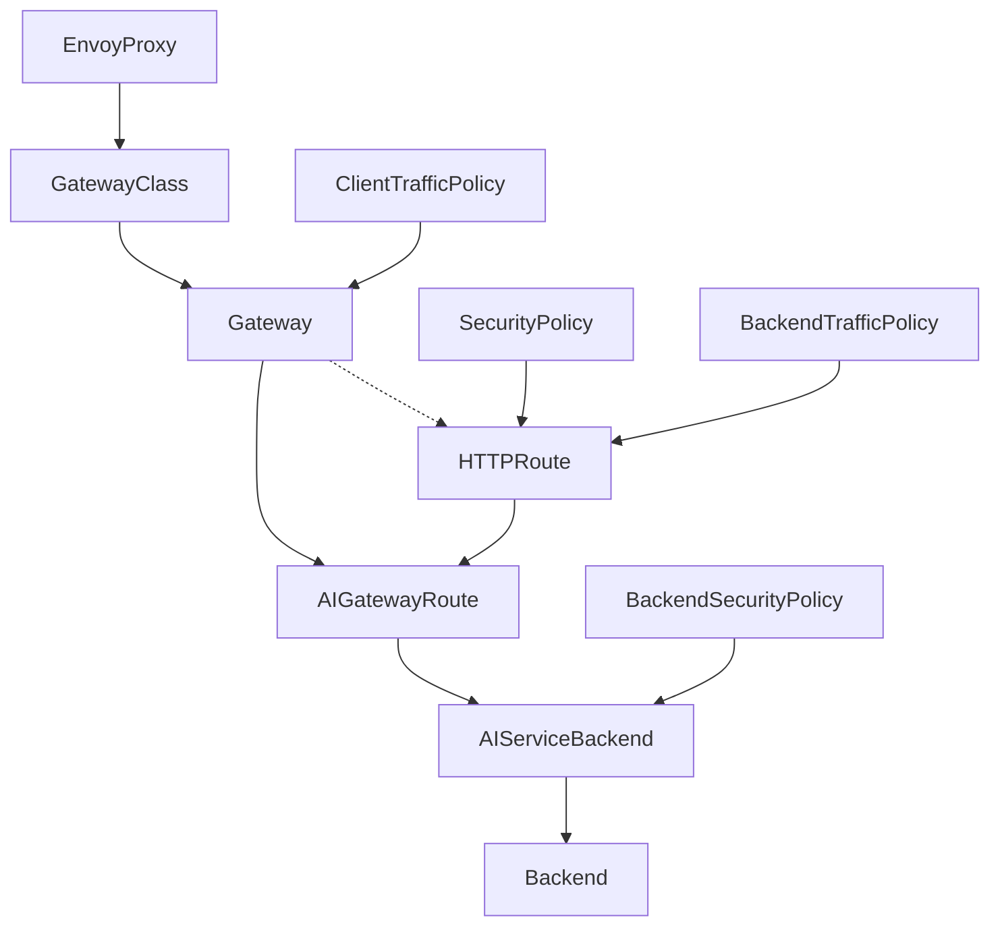

## vLLM/SGLang Instructions

:::caution
**Please remove all tolerations and priority classes before applying the configurations.** You are not supposed to use any tolerations to taints or priority classes, unless you have been approved by administrators for one or are an administrator yourself. Please refer to the [Special Use](/documentation/userdocs/running/special/) on this matter.
:::

**Note that the below contents are meant to be read by both people and AI. Feel free to feed the [Markdown File](https://gitlab.nrp-nautilus.io/prp/nrp-site/-/tree/main/src/content/docs/Documentation/admindocs/ai/managing_models.mdx) to LLMs.**

### Obtaining VRAM Requirements

[hf-mem](https://pypi.org/project/hf-mem/) is a useful way to determine the total size of weights loaded to the system, and shows an **incomplete** estimate of KV cache requirements (see notes below).

Example (set `HF_TOKEN` after agreeing to the model's license in Hugging Face if a `401 Unauthorized` error shows): `uvx hf-mem --model-id MiniMaxAI/MiniMax-M2.5 --experimental --batch-size 1 --kv-cache-dtype bfloat16`

**Example:**

```
┌┬┬┬┬┬┬┬┬┬┬┬┬┬┬┬┬┬┬┬┬┬┬┬┬┬┬┬┬┬┬┬┬┬┬┬┬┬┬┬┬┬┬┬┬┬┬┬┬┬┬ hf-mem v0.5.1 ┐
├┴┴┴┴┴┴┴┴┴┴┴┴┴┴┴┴┴┴┴┴┴┴┴┴┴┴┴┴┴┴┴┴┴┴┴┴┴┴┴┴┴┴┴┴┴┴┴┴┴┴┴┴┴┴┴┴┴┴┴┴┴┴┴┴┴┤
│                  INFERENCE MEMORY ESTIMATE FOR                  │
│           https://hf.co/MiniMaxAI/MiniMax-M2.5 @ main           │
│              w/ max-model-len=196608, batch-size=1              │
├────────────────┬────────────────────────────────────────────────┤
│ TOTAL MEMORY   │ 260.82 GiB (228.70B PARAMS + KV CACHE)         │
│ REQUIREMENTS   │ ██████████████████████████████████████████████ │
├────────────────┴────────────────────────────────────────────────┤
│               MODEL (228.70B PARAMS, 214.32 GiB)                │
├────────────────┬────────────────────────────────────────────────┤
│ F32            │ 0.23 / 260.82 GiB                              │
│ 62.65M PARAMS  │ ░░░░░░░░░░░░░░░░░░░░░░░░░░░░░░░░░░░░░░░░░░░░░░ │
├────────────────┼────────────────────────────────────────────────┤
│ BF16           │ 2.29 / 260.82 GiB                              │
│ 1.23B PARAMS   │ ░░░░░░░░░░░░░░░░░░░░░░░░░░░░░░░░░░░░░░░░░░░░░░ │
├────────────────┼────────────────────────────────────────────────┤
│ F8_E4M3        │ 211.79 / 260.82 GiB                            │
│ 227.41B PARAMS │ █████████████████████████████████████░░░░░░░░░ │
├────────────────┴────────────────────────────────────────────────┤
│               KV CACHE (196608 TOKENS, 46.50 GiB)               │
├────────────────┬────────────────────────────────────────────────┤
│ BF16           │ 46.50 / 260.82 GiB                             │
│ 196608 TOKENS  │ ████████░░░░░░░░░░░░░░░░░░░░░░░░░░░░░░░░░░░░░░ │
└────────────────┴────────────────────────────────────────────────┘
```

**IMPORTANT:** The KV cache estimate is likely inaccurate in many cases, **especially due to models that can take more context by using sliding window attention (SWA)**. Read the Hugging Face description of the model to see whether sliding window attention (SWA) is used within the model.

Normally, in models without sliding window attention (SWA) capabilities, the KV cache size needs to be above the context size of the model.

```
(EngineCore pid=432) INFO 00-00 00:00:00 [kv_cache_utils.py:1316] GPU KV cache size: 204,176 tokens
(EngineCore pid=432) INFO 00-00 00:00:00 [kv_cache_utils.py:1321] Maximum concurrency for 202,752 tokens per request: 1.01x
```

But when models use **sliding window attention (SWA)**, a much lower KV cache size can accommodate the full context.

```
(EngineCore pid=679) INFO 00-00 00:00:00 [kv_cache_utils.py:1733] GPU KV cache size: 4,919,610 tokens
(EngineCore pid=679) INFO 00-00 00:00:00 [kv_cache_utils.py:1734] Maximum concurrency for 1,010,000 tokens per request: 4.87x
```

Because of the above reasons, set the KV cache to `bfloat16` (`--kv-cache-dtype bfloat16`) to be conservative, but **do not give up fitting the model into available VRAM due to the reported KV cache in `hf-mem`, as long as at least the model weights fit in the total VRAM** (or CPU RAM when CPU offload is used). Set the same `--kv-cache-dtype` in vLLM/SGLang as well. Using `--kv-cache-dtype bfloat16` (or `--kv-cache-dtype auto` if explicitly setting `bfloat16` fails) is desirable for agentic coding workloads.

When `--kv-cache-dtype` is not set or set to `--kv-cache-dtype auto`, vLLM/SGLang may use `fp8` or `fp4` KV cache automatically when the training of the model itself was performed with quantization (like DeepSeek), and `hf-mem` cannot automatically detect this situation.

Based on the above information, **identify the adequate number and type of GPUs**, and edit the configuration files below to deploy the model.

### Core instructions

:::caution
If you are a namespace administrator reading this manual for your own namespace, use a relatively high `ingress.kubernetes.io/timeout-server` annotation on your **Ingress** resource if you experience any timeouts.
:::

Note that `--enable-request-id-headers --otlp-traces-endpoint <endpoint>`, `OTEL_EXPORTER_OTLP_TRACES_INSECURE`, and `OTEL_SERVICE_NAME` are optional and used typically only for the NRP-hosted models. For SGLang, use `--log-requests --log-requests-level 1 --enable-metrics --enable-trace --otlp-traces-endpoint <endpoint>` with `OTEL_EXPORTER_OTLP_TRACES_INSECURE` and `OTEL_SERVICE_NAME`.

The below are the set of example resources required to deploy an LLM model on the `nrp-llm` namespace (similar in the `sdsc-llm` namespace, but check the `StatefulSet` or `Deployment` examples within the namespace for differences):

**StatefulSet (Recommended):**

```yaml
apiVersion: apps/v1
kind: StatefulSet
metadata:
  labels:
    app: minimax-vllm-inference
    component: llm
  name: minimax-vllm-inference
  namespace: nrp-llm
spec:
  persistentVolumeClaimRetentionPolicy:
    whenDeleted: Retain
    whenScaled: Retain
  podManagementPolicy: OrderedReady
  replicas: 1
  selector:
    matchLabels:
      app: minimax-vllm-inference
  serviceName: minimax-vllm-inference
  template:
    metadata:
      labels:
        app: minimax-vllm-inference
        component: llm
    spec:
      affinity:
        nodeAffinity:
          requiredDuringSchedulingIgnoredDuringExecution:
            nodeSelectorTerms:
            - matchExpressions:
              # Specify when requiring specific GPUs but not for designated special GPUs such as `nvidia.com/a100` or `nvidia.com/rtxa6000`
              #- key: nvidia.com/gpu.product
              #  operator: In
              #  values:
              #  - NVIDIA-L40
              # In smaller models under 80GB, just setting `nvidia.com/gpu.memory` should be enough unless requiring specific GPU generations; in such cases, use `nvidia.com/gpu.compute.major` or `nvidia.com/gpu.compute.minor`, which defines the CUDA GPU Compute Capability (https://en.wikipedia.org/wiki/CUDA#GPUs_supported)
              - key: nvidia.com/gpu.memory
                operator: Gt
                values:
                - "80000"
              # At least GTX 2000 Series Turing GPUs (CUDA Capability 6.x) for CUDA 12 (use the `cu129-` image prefix; `v0.19.1` is the last version supporting GTX 1000 Series Pascal and Volta), Newer than Volta GPUs (CUDA Capability 7.0) for CUDA 13; https://en.wikipedia.org/wiki/CUDA#GPUs_supported
              - key: nvidia.com/gpu.compute.major
                operator: Gt
                values:
                - "7"
              # E.g., Greater Than 565 (>=570) for CUDA 12.8 or 12.9 (use the `cu129-` image prefix), Greater Than 575 (>=580) for CUDA 13.0; https://en.wikipedia.org/wiki/CUDA#GPUs_supported
              - key: nvidia.com/cuda.driver.major
                operator: Gt
                values:
                - "575"
      containers:
      - args:
        # Refer to the documentation for detailed setup; add `--enable-expert-parallel --enable-ep-weight-filter` in MoE models for better maximum total throughput
        - |
          vllm serve MiniMaxAI/MiniMax-M2.7 --port 5000 --host 0.0.0.0 --download-dir /workspace/.cache/huggingface/hub --api-server-count 8 --tensor-parallel-size 4 --enable-expert-parallel --enable-ep-weight-filter --trust-remote-code --enable-chunked-prefill --enable-prefix-caching --max-num-seqs 128 --gpu-memory-utilization 0.95 --max-model-len 204800 --max-num-batched-tokens 8192 --kv-cache-dtype bfloat16 --enable-auto-tool-choice --tool-call-parser minimax_m2 --reasoning-parser minimax_m2 --compilation-config '{"mode":3,"pass_config":{"fuse_minimax_qk_norm":true}}' --enable-request-id-headers --otlp-traces-endpoint http://otel-collector.nrp-llm.svc:4317
        command:
        - bash
        - -c
        env:
        # Required to allow the engine to initialize large models
        - name: VLLM_ENGINE_READY_TIMEOUT_S
          value: "86400"
        - name: PYTORCH_CUDA_ALLOC_CONF
          value: "expandable_segments:True"
        # Add environment variables when the Hugging Face or vLLM documentation specifies as beneficial
        #- name: SAFETENSORS_FAST_GPU
        #  value: "1"
        - name: OTEL_EXPORTER_OTLP_TRACES_INSECURE
          value: "true"
        - name: OTEL_SERVICE_NAME
          value: minimax-vllm-inference
        envFrom:
        - configMapRef:
            # Includes `HF_TOKEN` and `VLLM_API_KEY`; default configMap for nrp-llm; refer to other models in the namespace for sdsc-llm
            name: qwen-vllm-inference-config
        # Select the latest release version (https://hub.docker.com/u/vllm), or use nightly container commits if recent commit fixes model or tool calling (defaults to CUDA 13, use `cu129-` images for CUDA 12)
        image: vllm/vllm-openai:<v0.xx.xx_or_nightly-commit_hash>
        imagePullPolicy: Always
        name: minimax-vllm-inference
        ports:
        - containerPort: 5000
          name: http
          protocol: TCP
        resources:
          limits:
            # Burstable Threads = 2 * (1 + Number of GPUs + API Server Count (Minimum 1) + Data Parallelism Count (Minimum 1) + (1 if Data Parallelism Count > 1 else 0)); Set maximum possible if offloading to CPU RAM
            cpu: "28"
            # At least the model size
            memory: 360Gi
            # VRAM >= Model weight size in https://pypi.org/project/hf-mem/ + KV cache without CPU offload
            nvidia.com/a100: "4"
          requests:
            # Minimum Threads = 1 + Number of GPUs + API Server Count (Minimum 1) + Data Parallelism Count (Minimum 1) + (1 if Data Parallelism Count > 1 else 0)); Set maximum possible if offloading to CPU RAM
            cpu: "14"
            # Around half of the model size or whatever lesser amount the intended node can fit; more than half for multimodal models
            memory: 180Gi
            # VRAM >= Model weight size in https://pypi.org/project/hf-mem/ + KV cache without CPU offload
            nvidia.com/a100: "4"
        securityContext:
          allowPrivilegeEscalation: false
          capabilities:
            drop:
            - ALL
          runAsNonRoot: false
        volumeMounts:
        - mountPath: /dev/shm
          name: shm
        - mountPath: /workspace/.cache
          name: minimax-inference-volume
          subPath: cache
        startupProbe:
          httpGet:
            path: /health
            port: 5000
          failureThreshold: 900
          periodSeconds: 10
        readinessProbe:
          httpGet:
            path: /health
            port: 5000
          periodSeconds: 10
          failureThreshold: 6
        livenessProbe:
          httpGet:
            path: /health
            port: 5000
          periodSeconds: 30
          failureThreshold: 8
      priorityClassName: owner
      securityContext:
        runAsGroup: 0
        runAsNonRoot: false
        runAsUser: 0
      tolerations:
      - effect: NoSchedule
        key: nautilus.io/reservation
        operator: Equal
        value: nrp-llm
      - effect: PreferNoSchedule
        key: nvidia.com/gpu
        operator: Exists
      # Only set this when using 4 or 8 GPUs, not any other count such as 1, 2, or 6
      #- effect: NoSchedule
      #  key: nautilus.io/hardware
      #  operator: Equal
      #  value: large-gpu
      volumes:
      - emptyDir:
          medium: Memory
          sizeLimit: 10995116277760m
        name: shm
  volumeClaimTemplates:
  - apiVersion: v1
    kind: PersistentVolumeClaim
    metadata:
      name: minimax-inference-volume
    spec:
      accessModes:
      - ReadWriteOnce
      resources:
        requests:
          # 10-20% more than the model weight size in https://pypi.org/project/hf-mem/
          storage: 256Gi
      # May be linstor-unl if target node is in us-central or us-east, but use linstor-igrok over linstor-sdsu normally
      storageClassName: linstor-igrok
      volumeMode: Filesystem
---
apiVersion: v1
kind: Service
metadata:
  labels:
    component: llm
  name: minimax-vllm-inference
  namespace: nrp-llm
spec:
  ports:
  - name: http
    port: 5000
    protocol: TCP
    targetPort: 5000
  selector:
    app: minimax-vllm-inference
  type: ClusterIP
```

**Example StatefulSet for an embedding model:**

In this case, **`--runner pooling` and `--convert embed`** are important arguments for embedding models, where there are no arguments regarding tool calling and reasoning parsers.

The below configuration example uses the CUDA 12.9 build of vLLM due to allowing older GPUs than Turing, such as the Tesla V100 GPU. The default is to use the CUDA 13 build.

<details>
<summary>Open</summary>

```yaml
apiVersion: apps/v1
kind: StatefulSet
metadata:
  labels:
    app: qwen3-embedding-8b-vllm-inference
    component: llm
  name: qwen3-embedding-8b-vllm-inference
  namespace: nrp-llm
spec:
  persistentVolumeClaimRetentionPolicy:
    whenDeleted: Retain
    whenScaled: Retain
  podManagementPolicy: OrderedReady
  replicas: 1
  selector:
    matchLabels:
      app: qwen3-embedding-8b-vllm-inference
  serviceName: qwen3-embedding-8b-vllm-inference
  template:
    metadata:
      labels:
        app: qwen3-embedding-8b-vllm-inference
        component: llm
    spec:
      affinity:
        nodeAffinity:
          requiredDuringSchedulingIgnoredDuringExecution:
            nodeSelectorTerms:
            - matchExpressions:
              # Specify when requiring specific GPUs but not for designated special GPUs such as `nvidia.com/a100` or `nvidia.com/rtxa6000`
              #- key: nvidia.com/gpu.product
              #  operator: In
              #  values:
              #  - NVIDIA-L40
              # In smaller models under 80GB, just setting `nvidia.com/gpu.memory` should be enough unless requiring specific GPU generations; in such cases, use `nvidia.com/gpu.compute.major` or `nvidia.com/gpu.compute.minor`, which defines the CUDA GPU Compute Capability (https://en.wikipedia.org/wiki/CUDA#GPUs_supported)
              - key: nvidia.com/gpu.memory
                operator: Gt
                values:
                - "20000"
              # At least GTX 2000 Series Turing GPUs (CUDA Capability 6.x) for CUDA 12 (use the `cu129-` image prefix; `v0.19.1` is the last version supporting GTX 1000 Series Pascal and Volta), Newer than Volta GPUs (CUDA Capability 7.0) for CUDA 13; https://en.wikipedia.org/wiki/CUDA#GPUs_supported
              - key: nvidia.com/gpu.compute.major
                operator: Gt
                values:
                - "6"
              # E.g., Greater Than 565 (>=570) for CUDA 12.8 or 12.9 (use the `cu129-` image prefix), Greater Than 575 (>=580) for CUDA 13.0; https://en.wikipedia.org/wiki/CUDA#GPUs_supported
              - key: nvidia.com/cuda.driver.major
                operator: Gt
                values:
                - "565"
      containers:
      - args:
        # Refer to the documentation for detailed setup; add `--enable-expert-parallel --enable-ep-weight-filter` in MoE models for better maximum total throughput
        - |
          uv pip install --system 'qwen-vl-utils>=0.0.14' && vllm serve Qwen/Qwen3-VL-Embedding-8B --port 5000 --host 0.0.0.0 --download-dir /workspace/.cache/huggingface/hub --api-server-count 4 --tensor-parallel-size 2 --max-model-len 262144 --max-num-batched-tokens 8192 --kv-cache-dtype auto --runner pooling --convert embed --mm-processor-cache-gb 8 --mm-processor-cache-type shm --trust-remote-code --gpu-memory-utilization 0.95 --enable-request-id-headers --otlp-traces-endpoint http://otel-collector.nrp-llm.svc:4317
        command:
        - bash
        - -c
        env:
        # Required to allow the engine to initialize large models
        - name: VLLM_ENGINE_READY_TIMEOUT_S
          value: "86400"
        - name: PYTORCH_CUDA_ALLOC_CONF
          value: "expandable_segments:True"
        - name: OTEL_EXPORTER_OTLP_TRACES_INSECURE
          value: "true"
        - name: OTEL_SERVICE_NAME
          value: qwen3-embedding-8b-vllm-inference
        envFrom:
        - configMapRef:
            # Includes `HF_TOKEN` and `VLLM_API_KEY`; default configMap for nrp-llm; refer to other models in the namespace for sdsc-llm
            name: qwen-vllm-inference-config
        # Select the latest release version (https://hub.docker.com/u/vllm), or use nightly container commits if recent commit fixes model or tool calling (defaults to CUDA 13, use `cu129-` images for CUDA 12)
        image: vllm/vllm-openai:v0.19.1
        imagePullPolicy: Always
        name: qwen3-embedding-8b-vllm-inference
        ports:
        - containerPort: 5000
          name: http
          protocol: TCP
        resources:
          limits:
            # Burstable Threads = 2 * (1 + Number of GPUs + API Server Count (Minimum 1) + Data Parallelism Count (Minimum 1) + (1 if Data Parallelism Count > 1 else 0)); Set maximum possible if offloading to CPU RAM
            cpu: "16"
            # At least the model size
            memory: 128Gi
            # VRAM >= Model weight size in https://pypi.org/project/hf-mem/ + KV cache without CPU offload
            nvidia.com/gpu: "2"
          requests:
            # Minimum Threads = 1 + Number of GPUs + API Server Count (Minimum 1) + Data Parallelism Count (Minimum 1) + (1 if Data Parallelism Count > 1 else 0)); Set maximum possible if offloading to CPU RAM
            cpu: "8"
            # Around half of the model size or whatever lesser amount the intended node can fit; more than half for multimodal models
            memory: 64Gi
            # VRAM >= Model weight size in https://pypi.org/project/hf-mem/ + KV cache without CPU offload
            nvidia.com/gpu: "2"
        securityContext:
          allowPrivilegeEscalation: false
          capabilities:
            drop:
            - ALL
          runAsNonRoot: false
        volumeMounts:
        - mountPath: /workspace/.cache
          name: qwen3-embedding-8b-vllm-inference-volume
          subPath: cache
        - mountPath: /dev/shm
          name: shm
        startupProbe:
          httpGet:
            path: /health
            port: 5000
          failureThreshold: 900
          periodSeconds: 10
        readinessProbe:
          httpGet:
            path: /health
            port: 5000
          periodSeconds: 10
          failureThreshold: 6
        livenessProbe:
          httpGet:
            path: /health
            port: 5000
          periodSeconds: 30
          failureThreshold: 8
      priorityClassName: owner
      securityContext:
        runAsGroup: 0
        runAsNonRoot: false
        runAsUser: 0
      tolerations:
      - effect: NoSchedule
        key: nautilus.io/reservation
        operator: Equal
        value: nrp-llm
      - effect: PreferNoSchedule
        key: nvidia.com/gpu
        operator: Exists
      # Only set this when using 4 or 8 GPUs, not any other count such as 1, 2, or 6
      #- effect: NoSchedule
      #  key: nautilus.io/hardware
      #  operator: Equal
      #  value: large-gpu
      volumes:
      - emptyDir:
          medium: Memory
          sizeLimit: 10995116277760m
        name: shm
  volumeClaimTemplates:
  - apiVersion: v1
    kind: PersistentVolumeClaim
    metadata:
      name: qwen3-embedding-8b-vllm-inference-volume
    spec:
      accessModes:
      - ReadWriteOnce
      resources:
        requests:
          # 10-20% more than the model weight size in https://pypi.org/project/hf-mem/
          storage: 24Gi
      # May be linstor-unl if target node is in us-central or us-east, but use linstor-igrok over linstor-sdsu normally
      storageClassName: linstor-igrok
      volumeMode: Filesystem
---
apiVersion: v1
kind: Service
metadata:
  labels:
    component: llm
  name: qwen3-embedding-8b-vllm-inference
  namespace: nrp-llm
spec:
  ports:
  - name: http
    port: 5000
    protocol: TCP
    targetPort: 5000
  selector:
    app: qwen3-embedding-8b-vllm-inference
  type: ClusterIP
```

</details>

#### Multiple Resources of the Same Model

This section is not required for scaling the replica of the same StatefulSet resource with identical configurations, and is only required for different resources with different configurations (such as GPUs).

When using multiple different resources for the same model (not required when using multiple replicas for the same resource), for scaling (especially autoscaling) correctly, each LLM resource on Kubernetes should point to a single service, by using the same `selector:` and `label:` such as `service-group: minimax-vllm-inference` for example:

**Deployment** and **StatefulSet**:

```yaml
spec:
  template:
    metadata:
      labels:
        app: minimax-vllm-inference-a100
        component: llm
        service-group: minimax-vllm-inference
```

**Service**:

```yaml
spec:
  selector:
    service-group: minimax-vllm-inference
```

#### Scavenging Replicas (Low Priority)

For managed LLMs, scavenging capacity should be deployed as **replicas of an existing model service** (same model ID and same service group) so service continuity is maintained if scavenging instances are preempted.

Use a **negative priority class** for scavenging workloads so they are preempted before normal managed replicas when higher-priority workloads need capacity.

For managed scavenging replicas on this cluster, use `priorityClassName: nice` (`value: -10`).

Current managed scavenging example:

- Model: `Qwen/Qwen3.6-27B`
- Pattern: scavenging instances are additional replicas of the normal managed deployment, not a separate model endpoint

Example priority class setting in a scavenging StatefulSet/Deployment:

```yaml
spec:
  template:
    spec:
      priorityClassName: nice
```

#### Miscellaneous Information

- In the above case, the `Backend` for Envoy AI Gateway when used should be configured as `hostname: minimax-vllm-inference.nrp-llm.svc.cluster.local` and `port: 5000`.

- Refer to the below instructions for configuring vLLM/SGLang and for configuring Envoy AI Gateway for managed AI models.

- Read the **Pipeline Parallelism** section when using more than `--pipeline-parallel-size 1`.

### How to load models into GPUs

**Refer to:** https://docs.vllm.ai/en/latest/configuration/conserving_memory/

1. Read individual instructions for each model (both from Hugging Face and vLLM/SGLang) carefully, and also check deployment configurations from other models. The recommended number of CPU threads for `requests:` is `Minimum Threads = 1 + Number of GPUs + API Server Count (Minimum 1) + Data Parallelism Count (Minimum 1) + (1 if Data Parallelism Count > 1 else 0))`, and for `limits:` is `Burstable Threads = 2 * (1 + Number of GPUs + API Server Count (Minimum 1) + Data Parallelism Count (Minimum 1) + (1 if Data Parallelism Count > 1 else 0))`; read below for API Server Count (`--api-server-count`) and Data Parallelism Count (`--data-parallel-size`). However, set **CPU thread counts to the maximum possible if offloading to CPU RAM**. The recommended RAM size is `request: [slightly over half of total loaded model size]`, `limit: [slightly over total loaded model size]`, where more is required for multimodal models.
2. Tune `--gpu-memory-utilization` to ideally fit enough KV cache that is larger than `--max-model-len`, but with enough space for CUDA graphs to be built. This is typically calculated outside `--gpu-memory-utilization`, so if the CUDA graph build stage errors with not enough memory, `--gpu-memory-utilization` has to be lowered. Moreover, some multimodal models may also consume more memory outside `--gpu-memory-utilization` for certain reasons. If there is an error about insufficient KV cache, `--gpu-memory-utilization` has to be increased, or if both errors occur, consult the next step.
3. Moreover, note that if the `num_key_value_heads` in `config.json` is lower than the `--tensor-parallel-size` (typically the number of GPUs in a simple configuration), KV cache is duplicated, reducing the context width available from vLLM. In multi-head latent attention (MLA) models like DeepSeek or Kimi, `num_key_value_heads` is always considered `1` even if `config.json` says otherwise. An initial solution is deduplicating the KV cache by: (1) only increasing `--tensor-parallel-size` until `num_key_value_heads`, then use `--pipeline-parallel-size` for the rest of the GPUs required to load the weights (read the **Pipeline Parallelism** section when using more than `--pipeline-parallel-size 1`.), or (2) to use Context Parallelism (`--decode-context-parallel-size`) so that the product (multiplication) of `--decode-context-parallel-size` and `num_key_value_heads` equals `--tensor-parallel-size`, especially in multi-head latent attention (MLA) models such as DeepSeek and Kimi families. Consult the detailed dedicated instructions for various types of parallelism below.
4. Do not use `--enforce-eager` unless absolutely necessary, as this cuts the token throughput into 1/4 to 1/6 in many cases. CUDA graphs lead to a substantial performance benefit. Using this should only happen if other efforts below have failed to achieve the designed context length of the model. An alternative is to use `--compilation-config "{\"cudagraph_mode\": \"PIECEWISE\"}"`, as this argument retains some level of CUDA graph capability while conserving VRAM, but the conservation is likely about half to one GB, and has visible token throughput sacrifices.
5. Tune `--max-num-seqs` first, before modifying the maximum context length (`--max-model-len`) anywhere below the full context. The initial priority is always to achieve the designed full context length of the model, so tune other parameters before changing `--max-model-len`. The `--mm-encoder-tp-mode`, `--mm-processor-cache-type` (typically set to `shm` in more than one GPU), and `--mm-processor-cache-gb` arguments (only set to `0` when the CPU RAM is insufficient; a very rare situation, and multimodal inputs are mostly unique and non-repeating) may also be relevant for some multimodal models.
6. Test that the model works when a large part of the KV cache has been filled through the prompts. Some models may have volatile VRAM consumption during runtime and may get out-of-memory errors even after successful initialization.
7. Check if there are methods which improve throughput or increase KV cache capacity, including multi-token prediction (also called speculative decoding), including Context Parallelism (`--decode-context-parallel-size`), or Data Parallelism Attention + Expert Parallelism (`--enable-expert-parallel --enable-ep-weight-filter` with `--data-parallel-size` in vLLM or `--expert-parallel-size` and `--enable-dp-attention` in SGLang). More explanations are below.
8. Consider using `--kv-offloading-backend native --kv-offloading-size <size_in_GB>`, where more information is available in [KV Offloading Connector](https://blog.vllm.ai/2026/01/08/kv-offloading-connector.html). However, this is **not a solution for when 1x full context does not fit** within the KV cache of the GPU, and 1x full context should still fit inside the GPU KV cache regardless.

### Improving LLM Engine Performance 

**Optimizing vLLM performance and responsiveness:** https://docs.vllm.ai/en/latest/configuration/optimization/ and https://developers.redhat.com/articles/2026/03/09/5-steps-triage-vllm-performance

The equation for CPU thread consumption for `requests:` is `Minimum Threads = 1 + Number of GPUs + API Server Count (Minimum 1) + Data Parallelism Count (Minimum 1) + (1 if Data Parallelism Count > 1 else 0))`, and for `limits:` is `Burstable Threads = 2 * (1 + Number of GPUs + API Server Count (Minimum 1) + Data Parallelism Count (Minimum 1) + (1 if Data Parallelism Count > 1 else 0))`.

**However, set maximum threads possible if offloading weights or KV cache to CPU RAM.**

1. Increase internal API server count (`--api-server-count`) to a value larger than `1` (perhaps `4` for smaller models or `8` for larger models); this allows multithreaded processing for tokenization and input processing.
2. For multimodal models, set `--mm-processor-cache-gb` (in GB, frequently paired with `--mm-processor-cache-type shm` in more than 1 GPU) to a higher value than the default of `4` (perhaps `8`). Increase request and limit CPU RAM with `--mm-processor-cache-gb` multiplied by `--api-server-count`.
3. For models that incorporate Mamba or Mamba-hybrid architectures, you must add `--mamba-cache-mode align` to enable prefix caching.
4. (**Decreases available KV cache by potentially a significant amount, so increase when the VRAM for KV cache is more than enough for 1x context size.**) Increase `--max-num-batched-tokens` to `8192`, as this is the sweet spot for balancing latency with performance and VRAM consumption. Decrease if VRAM is insufficient, and the default when the argument is unspecified is currently `2048` (but may vary for different model architectures).

### CPU Offloading

Key environment variables and arguments related to CPU offloading:
- In multimodal models, activate multimodal CPU RAM cache with `--mm-processor-cache-gb <size_in_GB>` (frequently paired with `--mm-processor-cache-type shm` in more than 1 GPU)
- `PYTORCH_ALLOC_CONF="expandable_segments:True"`, `VLLM_WEIGHT_OFFLOADING_DISABLE_PIN_MEMORY="1"` (**mandatory for all cases of CPU offloading currently**)
- `VLLM_WEIGHT_OFFLOADING_DISABLE_UVA="1"` (depends on the model or GPU, refer to https://github.com/vllm-project/vllm/pull/32993)
- `--offload-backend <prefetch/uva>`, `--cpu-offload-gb <size_in_GB>`, etc. (refer to `OffloadConfig` in https://docs.vllm.ai/en/latest/configuration/engine_args/) Example of offloading all layers to the CPU to make space for KV cache in VRAM; either `--offload-backend uva --cpu-offload-gb <size_in_GB>` for UVA mode or `--offload-backend prefetch --offload-group-size 1 --offload-num-in-group 1 --offload-prefetch-step 1` for Prefetch mode (`--cpu-offload-gb` is only for UVA)
- `--kv-offloading-backend native --kv-offloading-size <size_in_GB>`, where more information is available in [KV Offloading Connector](https://blog.vllm.ai/2026/01/08/kv-offloading-connector.html)

If using NVIDIA NIM, refer to the [Multi-LLM NIM](https://docs.nvidia.com/nim/large-language-models/latest/getting-started.html#option-3-hugging-face-or-local-disk-multi-llm-nim) guide and [NVIDIA AI Blueprint: Bring Your LLM to NIM](https://github.com/NVIDIA-AI-Blueprints/bring-llms-to-nim).

### Increasing Context Length with RoPE

RoPE (Rotary Position Embedding) allows expanding the context size beyond the default allowed by the model. For smaller factors (`max_position_embeddings / original_max_position_embeddings`), `dynamic` RoPE can be used. For larger factors, `yarn` RoPE could also be used, if the model supports this method. **Note that if there are separate instructions from the model, those instructions are prioritized**, and the format of `--hf-overrides` depends on the model's `config.json` file. Set `VLLM_ALLOW_LONG_MAX_MODEL_LEN` to `1` after adding the RoPE scaling configuration.

Example for [MiniMaxAI/MiniMax-M2.5](set `VLLM_ALLOW_LONG_MAX_MODEL_LEN` to `1`, https://huggingface.co/MiniMaxAI/MiniMax-M2.5): `--max-model-len 262144 --hf-overrides '{"rope_scaling": {"type": "dynamic", "factor": 1.5, "original_max_position_embeddings": 196608}}'`

Example for [Qwen/Qwen3.5-397B-A17B-FP8](set `VLLM_ALLOW_LONG_MAX_MODEL_LEN` to `1`, https://huggingface.co/Qwen/Qwen3.5-397B-A17B-FP8): `--max-model-len 1010000 --hf-overrides '{"text_config": {"rope_parameters": {"mrope_interleaved": true, "mrope_section": [11, 11, 10], "rope_type": "yarn", "rope_theta": 10000000, "partial_rotary_factor": 0.25, "factor": 4.0, "original_max_position_embeddings": 262144}}}'`

### Miscellaneous Advice

- Read the **Pipeline Parallelism** section when using more than `--pipeline-parallel-size 1`.
- For deploying very new models with new architectures where configurations cannot be inherited from a previous model generation, administrators would likely have to hunt through issues and pull request commits through GitHub, or in some cases, contribute changes themselves.
- The real-life experiences of agentic LLM models depend extremely heavily on tool calling and reasoning parser implementations. What was advertised to work in the provider's own API may not work or lead to disappointing outcomes in the model engines (vLLM/SGLang) because of tool calling and reasoning parsers. Problems in tool calling and reasoning parsers are easily over 75% of all previously experienced issues required to be troubleshooted, and the remaining under 25% are mostly issues in model parallelism or backend kernels.

### Health, Readiness, and Startup Probes

vLLM and SGLang expose a `/health` endpoint (no authentication required) on the same port as the API server (default `5000`). Adding Kubernetes probes to every StatefulSet or Deployment is strongly recommended — without them, Kubernetes sends traffic to pods that are still loading model weights, and crashed pods are never restarted automatically.

**Why each probe matters:**

- **`startupProbe`**: Gives the pod time to load model weights before liveness/readiness checks begin. Large models (30B+) can take 2–90 minutes to initialize. Without this, a liveness probe will kill the pod before it ever finishes loading.
- **`readinessProbe`**: Removes the pod from the Service's endpoint pool while it is loading or unhealthy. With multiple replicas, this ensures traffic only reaches pods that are actually ready — critical for rolling restarts with ReadWriteOnce PVCs.
- **`livenessProbe`**: Restarts the pod if the inference server hangs (e.g., NCCL deadlock across tensor-parallel workers, OOM in a non-crashing state).

**Recommended probe configuration (tune `failureThreshold` to your model size):**

```yaml
        startupProbe:
          httpGet:
            path: /health
            port: 5000
          failureThreshold: 270
          periodSeconds: 10
        readinessProbe:
          httpGet:
            path: /health
            port: 5000
          periodSeconds: 10
          failureThreshold: 6
        livenessProbe:
          httpGet:
            path: /health
            port: 5000
          periodSeconds: 30
          failureThreshold: 8
```

**Startup time guidance by model size:**

| Model size | Typical load time | Recommended `failureThreshold` (at `periodSeconds: 10`) |
|---|---|---|
| < 10B | 1–3 min | 60–90 |
| 10B–40B | 3–10 min | 90–270 |
| 40B–100B | 5–15 min | 180–360 |
| 100B+ / multi-node | 10–90 min | 270–2160 |

**Important — Deployment update strategy with ReadWriteOnce PVCs:**

If the model weights are stored on a ReadWriteOnce (RWO) PVC, set the Deployment's update strategy to `Recreate` instead of the default `RollingUpdate`. Otherwise Kubernetes will try to attach the volume to a new pod while the old pod still holds it, producing a `Multi-Attach error`.

```yaml
  strategy:
    type: Recreate
```

StatefulSets with `podManagementPolicy: OrderedReady` are not affected — they terminate the old pod before creating the new one.

**Note:** The `/health` endpoint returns `200 OK` only after vLLM has completed model weight loading and CUDA graph capture. During loading it either refuses connections or returns non-200 responses, which is expected and handled by the `startupProbe:` window.

### GPU Count Issue: Error with hidden/intermediate/block/... size division / Worker failed with error 'Invalid thread config'

When there is an error about layer count divisibility or invalid configurations, this does not necessarily mean that the GPU is not compatible. Rather, it may be about the count of GPUs (because tensor parallelism needs a perfect division of the number of hidden/intermediate/block/... size).

This may be caused by all sorts of model architectural reasons, when the **count of GPUs are too large (like 8), too small (like 2), or unconventional (like 6), while using tensor parallelism**. This all depends on the model architecture, and may be resolved by the below instructions on model parallelism.

### Model Parallelism

Model parallelism is the most important concept in high-parameter multi-GPU/multi-node LLM inference. Different types of parallelism (data, tensor, pipeline, context/sequence) are frequently combined together as they are on different axes.

Model parallelism determines whether a model fits in the set of hardware we have, and how much KV cache we can extract from the hardware. This is the most important part of LLM deployment that administrators can control.

#### Tensor Parallelism

**Abstract:** Default within a single-node (in multi-node, the default is to combine tensor parallelism within a single-node to pipeline parallelism between different nodes). `--tensor-parallel-size` shards model weights equally to each GPUs, but will duplicate KV cache across GPUs if `--tensor-parallel-size` is larger than `num_key_value_heads` or always duplicate KV cache across GPUs in multi-had latent attention (MLA) models. KV cache duplication is solved by decode context parallelism or pipeline parallelism.

Tensor parallelism (`--tensor-parallel-size`) is the default method to use to load models into multiple GPUs within a single node with high-performance GPU interconnect or P2P (e.g., NVLink/XGMI). Some issues may be solved by specifying expert parallelism (`--enable-expert-parallel --enable-ep-weight-filter`) in addition to `--tensor-parallel-size`, where whole expert layers are allocated one-by-one to each GPU. Refer to the next parts for details.

An issue with tensor parallelism is that the KV cache is duplicated to each GPU device with tensor parallelism when the number of `num_key_value_heads` in `config.json` is smaller than `--tensor-parallel-size` or when multi-head latent attention (MLA) is used, leading to decreased KV cache capacity and wasting VRAM space, unless context parallelism or pipeline parallelism is used to deduplicate the KV cache. Descriptions are in relevant sections.

#### Expert Parallelism

**Abstract:** When tensor parallelism (`--tensor-parallel-size`) is combined with expert parallelism (`--enable-expert-parallel --enable-ep-weight-filter` in vLLM, or the same `--expert-parallel-size` size as `--tensor-parallel-size` in SGLang) in an Mixture of Experts (MoE) model, the LLM engine (vLLM/SGLang) only shards dense attention layers within the model, and allocates whole expert layers into each GPU instead of sharding them, improving maximum total throughput.

For Mixture of Experts (MoE) models, tensor parallelism without expert parallelism shards all expert layers equally in each GPU, while tensor parallelism with expert parallelism loads different individual expert layers onto each GPU.

For instance, if each expert layer is considered a cube, all cubes are equally cut with a knife into the number of GPUs, and each cut piece of the cube is loaded to each GPU. Therefore, each GPU has one split of all expert layers of the model. The same happens and is the default for Dense models as well. But if expert parallelism is utilized, instead of cutting each cube with a knife, different individual whole cubes are loaded into each GPU. Dense attention layers are sharded like normal tensor parallelism either way, but this can be changed so that dense attention layers use data parallelism. Relevant descriptions are available in the section for data parallelism.

Tensor parallelism without expert parallelism ensures equal load to all GPUs, but may limit maximum total throughput due to interconnect bottlenecks. Tensor parallelism with expert parallelism tends to provide better maximum total throughput, but may potentially lead to GPU load imbalance when many concurrent requests are routed to only some of the expert layers. Expert parallelism can improve the time to first token (TTFT), lead to improved performance when the model is loaded across multiple nodes, combining expert parallelism with data parallelism, or when the interconnects between GPUs are bottlenecked. However, expert parallelism combined with tensor parallelism may lead to better or worse results in various situations, so case-by-case consideration is required.

Expert parallelism load balancer (EPLB) is a load balancing technique to balance the load of expert parallelism within GPUs.

#### Context Parallelism

**Abstract:** Context parallelism shards and deduplicates the KV cache when there is duplication across GPUs. Decode context parallelism (`--decode-context-parallel-size`) is normally mandatory for multi-head latent attention (MLA) models and may benefit other models with lower `num_key_value_heads` values in `config.json` than `--tensor-parallel-size`. Prefill context parallelism (`--prefill-context-parallel-size`) deduplicates KV cache but duplicates model weights, thus being mostly ineffective for conserving VRAM for model weights. Other types of context parallelism methods such as Helix parallelism are gaining attention.

Decode context parallelism (`--decode-context-parallel-size`) is not needed in tensor parallelism when the model is not a multi-head latent attention (MLA) model **AND** `num_key_value_heads` in `config.json` is larger than or equal to `--tensor-parallel-size`, because each `num_key_value_heads` is distributed to each GPU. However, when `num_key_value_heads` becomes smaller than `--tensor-parallel-size` or when multi-head latent attention (MLA) models are used, you should use decode context parallelism (`--decode-context-parallel-size`) so that the product (multiplication) of `num_key_value_heads` (which is always `1` when MLA models are used regardless of `config.json`) and `--decode-context-parallel-size` becomes `--tensor-parallel-size`.

**NOTE**: Many LLM models have over 16 to 128 `num_key_value_heads`, but recently, models such as Qwen3.5 or GLM-4.7 only have 2-8 `num_key_value_heads`, which indicates that decode context parallelism should be used if available. Decode context parallelism should always be used for multi-head latent attention (MLA) models when available because where the KV cache is compressed into a lower-dimensional latent space, and the number of KV heads visible to the LLM engine (vLLM) decreases to `1` (especially in DeepSeek-V3/R1 series and derived models such as Kimi-K2 or GLM-5). Therefore, `num_key_value_heads` in `config.json` larger than `--tensor-parallel-size` **does not** always mean that there won't be any duplicated KV cache, and any models using multi-head latent attention (MLA) should assume `num_key_value_heads` as being 1. The `use_mla` property in [`vllm/config/model.py`](https://github.com/vllm-project/vllm/blob/main/vllm/config/model.py) decides which model uses MLA.

Prefill context parallelism (`--prefill-context-parallel-size`) deduplicates KV cache but duplicates model weights, thus being mostly ineffective for conserving VRAM for model weights, but may have purposes for ultra-large-context models. Other types of context parallelism methods for ultra-large-context such as Helix parallelism, which shards the KV cache further beyond the constraints of decode context parallelism, are gaining attention.

#### Pipeline Parallelism

**Abstract:** Pipeline parallelism (`--pipeline-parallel-size`) is the default method when sharding model weights across multiple GPU nodes, where it is combined with tensor parallelism (`--tensor-parallel-size`) within GPUs of single nodes. It is also an alternative to decode context parallelism (`--decode-context-parallel-size`) for deduplicating KV cache when specific models do not have decode context parallelism implemented, only setting `--tensor-parallel-size` up to the `num_key_value_heads` in `config.json` and using `--pipeline-parallel-size` to shard both the model weights and KV cache further within a single node, or when the model fits within an unconventional number of GPUs (not in powers of two).

**If a chat request stops in the middle of responses (or a CUDA memory allocation error) when pipeline parallelism is enabled, the steps below are very likely to solve the problem:**

**How?** If you have sufficient KV cache, reducing `--gpu-memory-utilization` (typically to `0.925` or `0.9`) is a simple solution. **HOWEVER, it is possible to extract more KV cache capacity.** You can use `VLLM_PP_LAYER_PARTITION` (or `SGLANG_PP_LAYER_PARTITION`) to balance out the per-GPU VRAM consumption (it tends to be imbalanced with pipeline parallelism compared to tensor parallelism). By default, the layers are split evenly, but the last PP stage tends to also carry the language modelling (LM) head and the sampler's vocab-sized activations on top of its share of hidden layers. Since the KV cache is sized from the most constrained stage, that one stage caps the KV cache for the entire pipeline — which is why an even split leaves capacity on the table on every other GPU. The fix is to give the last stage fewer layers and push the surplus onto the earlier stages. For example, on `--pipeline-parallel-size 8`: `VLLM_PP_LAYER_PARTITION="11,10,10,10,10,10,10,7"` (the first layer uses less VRAM, so an extra layer is added). The total should be equal to `"num_hidden_layers"` of the model's `config.json`.

Combining pipeline parallelism (`--pipeline-parallel-size`) with tensor parallelism (`--tensor-parallel-size`) is an acceptable solution that works with unconventional GPU counts (not in powers of two), or when errors such as `Error with hidden/intermediate/block/... size division / Worker failed with error 'Invalid thread config', etc.` occur. An example is using 6 GPUs through `--tensor-parallel-size 2 --pipeline-parallel-size 3`, 8 GPUs using `--tensor-parallel-size 2 --pipeline-parallel-size 4`, or `--tensor-parallel-size 4 --pipeline-parallel-size 2`, due to pipeline parallelism tolerating uneven splits of layers.

Moreover, pipeline parallelism is an acceptable method for deduplicating KV cache when specific models do not have decode context parallelism supported, where `--tensor-parallel-size` is only set until the `num_key_value_heads` in `config.json`, and using `--pipeline-parallel-size` to shard both the model weights and KV cache further within a single node. For example, in [Qwen/Qwen3.5-397B-A17B-FP8](https://huggingface.co/Qwen/Qwen3.5-397B-A17B-FP8), `num_key_value_heads` is `2` within `config.json` and the model is not multi-head latent attention (MLA). In this case, we can use `--tensor-parallel-size 2` so that `--tensor-parallel-size` is not larger than `num_key_value_heads`, and use `--pipeline-parallel-size 2` to load the model weights and shard the KV cache without duplication into a multiplied total of four GPUs. For multi-head latent attention (MLA) models, always assume that `num_key_value_heads` is `1`, regardless of the value specified in `config.json`.

However, pipeline parallelism has some non-negligible VRAM overhead and may lead to suboptimal performance. But on contrary, pipeline parallelism using GPUs inside a single node **that lacks** high-performance interconnects (e.g., NVLink/XGMI) or utilizing consumer GPUs **without** P2P communication may lead to better performance than on tensor parallelism. This may be the case especially in consumer GPUs without HBM memory, but not necessarily professional (e.g., Quadro, RTX Pro) GPUs, and most likely not in datacenter (e.g., A100, H200, B100) GPUs.

Similar to tensor parallelism, expert parallelism (`--enable-expert-parallel --enable-ep-weight-filter`) may be added as adequate if the configuration without the argument does not work, but first trying without expert parallelism enabled is recommended.

Pipeline parallelism is the recommended and default way to shard models across multiple nodes when the model weights and KV cache do not fit in a single node, and do not have dedicated high-performance interconnects betwen nodes, but unless specified in conditions above, people should prefer tensor parallelism within single nodes with a high-performance interconnect.

**Important:** It is entirely possible that **when a high pipeline parallelism count is used, for vLLM to wait a long time after the message `Application startup complete.`, then the requests come in**; this is the LLM engine initializing the pipelines in pipeline parallelism taking longer then tensor parallelism. Moreover, there may be an error `raise TimeoutError(f"RPC call to {method} timed out.")` if this prolongs. If you face the above issues, add the below environment variable(s) to eliminate the timeout error and wait until the responses come in (this may take at least a few minutes to over ten minutes **even after `Application startup complete.` shows and requests come in**):

```yaml
        env:
        - name: VLLM_RPC_TIMEOUT
          value: "1200000"
```

#### Data Parallelism

**Abstract**: Data parallelism (`--data-parallel-size`), in its original design, duplicates model weights across GPUs to increase token throughput and instance capacity. However, it is useful in Mixture of Experts (MoE) models combining expert parallelism (`--enable-expert-parallel --enable-ep-weight-filter` in vLLM, or `--expert-parallel-size` in SGLang), where each whole expert layer can be placed in different GPUs, and only duplicates dense attention layers.

Data parallelism (`--data-parallel-size`), in its original design, has the most VRAM overhead, due to copying all of the same weights and layers redundantly across different GPUs, instead of sharding and dispersing weights across multiple GPUs. Data parallelism typically leads to an improvement in throughput when there are GPUs or nodes to spare, and is also able to combine with tensor parallelism or pipeline parallelism. But in essence, data parallelism does not assist in reducing VRAM consumption by sharding model weights, only increasing throughput by investing more computational resources.

**Expert Parallelism with Data Parallelism Attention**: However, expert parallelism (`--enable-expert-parallel --enable-ep-weight-filter`) makes data parallelism relevant for distributing models across multiple GPUs. As explained in the expert parallelism section, expert parallelism allows different GPUs to load different whole expert layers instead of all GPUs loading the same layers. This is also the case when combined with data parallelism attention, where expert layers can be dispersed to multiple nodes and multiple GPUs without duplication.

Mixture of Experts (MoE) models with data parallelism attention may reduce KV cache consumption (`--enable-expert-parallel --enable-ep-weight-filter` with `--data-parallel-size` in vLLM or `--enable-dp-attention` with `--expert-parallel-size` in SGLang), possibly utilizing KV cache more efficiently compared to other parallelism options while likely providing higher concurrent token throughput. 

In such cases, only the dense attention layers are duplicated across GPUs, reducing the redundancy of weights in an Mixture of Experts (MoE) model. However, because dense attention layers are still duplicated redundantly across multiple GPUs due to data parallelism, more VRAM is likely consumed, possibly defeating the goal of reducing KV cache consumption unless VRAM is sufficient. To solve this issue, people may also use tensor parallelism within single nodes to shard the duplicate dense attention layers, with minimal implications on throughput or latency. **This way, different expert layers are distributed to multiple nodes while more users can be accommodated using expert parallelism with data parallelism attention, and the duplicated dense attention layers can be sharded with tensor parallelism per each node**.

External load balancing using expert parallelism load balancers (EPLB) through an external router, such as [llm-d](https://llm-d.ai/), combined with data parallelism and expert parallelism, has a good potential to balance performance improvements and provide better KV cache capacity through inter-instance coordination through RPC communication in large-scale deployments.

#### Combining Everything Together

Model parallelism can work in multiple dimensions. For example, a production deployment can use all of the above model parallelism methods.

Example ([moonshotai/Kimi-K2.6](https://huggingface.co/moonshotai/Kimi-K2.6)):

Kimi-K2.6 (`KimiK25ForConditionalGeneration` and `DeepseekV3ForCausalLM`) is a Multi-Latent Attention (MLA) model (like DeepSeek-V3.1).

To use two nodes for this model, we can use something similar to `--tensor-parallel-size 4 --decode-context-parallel-size 4 --pipeline-parallel-size 2` to make two instances (Pods) of vLLM and deploy two 4x RTX PRO 6000 Blackwell GPU Pods, while properly sharding the KV cache. This is the default configuration for an instance of the model, without duplication through data parallelism.

Example Configuration (do not use `--mm-processor-cache-type shm` in multi-node):

<details>
<summary>Open</summary>

```yaml
apiVersion: v1
kind: Service
metadata:
  name: kimi-bw-vllm-inference
  namespace: nrp-llm
  labels:
    app: kimi-bw-vllm-head
spec:
  # Standard service to expose the API strictly pointing to the Head Node
  type: ClusterIP
  selector:
    # Explicitly only targets the head node
    app: kimi-bw-vllm-head
  ports:
  - name: http
    port: 5000
    targetPort: 5000
    protocol: TCP
---
apiVersion: v1
kind: Service
metadata:
  name: kimi-bw-vllm-master
  namespace: nrp-llm
  labels:
    group: kimi-bw-vllm
spec:
  # Headless service for internal StatefulSet pod DNS resolution
  clusterIP: None
  publishNotReadyAddresses: true
  selector:
    # Selects both head and worker pods for internal communication
    group: kimi-bw-vllm
  ports:
  - name: tcp
    port: 29501
    targetPort: 29501
    protocol: TCP
---

apiVersion: networking.k8s.io/v1
kind: NetworkPolicy
metadata:
  name: kimi-bw-vllm-inference
  namespace: nrp-llm
spec:
  podSelector:
    matchLabels:
      group: kimi-bw-vllm
  policyTypes:
  - Ingress
  ingress:
  # Allow all traffic, but only if it comes from other inference pods
  - from:
    - podSelector:
        matchLabels:
          group: kimi-bw-vllm
  # Allow API access (Port 5000) from anywhere
  - ports:
    - protocol: TCP
      port: 5000
---
apiVersion: apps/v1
kind: StatefulSet
metadata:
  labels:
    app: kimi-bw-vllm-head
    group: kimi-bw-vllm
    component: llm
  name: kimi-bw-vllm-head
  namespace: nrp-llm
spec:
  serviceName: kimi-bw-vllm-master
  persistentVolumeClaimRetentionPolicy:
    whenDeleted: Retain
    whenScaled: Retain
  replicas: 1
  selector:
    matchLabels:
      app: kimi-bw-vllm-head
  template:
    metadata:
      labels:
        app: kimi-bw-vllm-head
        group: kimi-bw-vllm
        component: llm
    spec:
      affinity:
        nodeAffinity:
          requiredDuringSchedulingIgnoredDuringExecution:
            nodeSelectorTerms:
            - matchExpressions:
              - key: nvidia.com/cuda.driver.major
                operator: Gt
                values:
                - "575"
              - key: nvidia.com/gpu.memory
                operator: Gt
                values:
                - "80000"
              - key: nvidia.com/gpu.product
                operator: In
                values:
                - NVIDIA-RTX-PRO-6000-Blackwell-Max-Q-Workstation-Edition
        podAffinity:
          preferredDuringSchedulingIgnoredDuringExecution:
          - weight: 100
            podAffinityTerm:
              labelSelector:
                matchExpressions:
                - key: group
                  operator: In
                  values:
                  - kimi-bw-vllm
              topologyKey: kubernetes.io/hostname
      containers:
      - args:
        - |
          RANK=0
          MASTER_ADDR="kimi-bw-vllm-head-0.kimi-bw-vllm-master.nrp-llm.svc.cluster.local"

          vllm serve \
            moonshotai/Kimi-K2.6 \
            --port 5000 \
            --host 0.0.0.0 \
            --download-dir /workspace/.cache/huggingface/hub \
            --tensor-parallel-size 4 \
            --enable-expert-parallel \
            --enable-ep-weight-filter \
            --decode-context-parallel-size 4 \
            --pipeline-parallel-size 2 \
            --nnodes 2 \
            --node-rank $RANK \
            --master-addr $MASTER_ADDR \
            --master-port 29501 \
            --api-server-count 8 \
            --trust-remote-code \
            --enable-chunked-prefill \
            --enable-prefix-caching \
            --max-num-seqs 64 \
            --gpu-memory-utilization 0.9 \
            --max-model-len 262144 \
            --max-num-batched-tokens 8192 \
            --kv-cache-dtype bfloat16 \
            --enable-auto-tool-choice \
            --tool-call-parser kimi_k2 \
            --reasoning-parser kimi_k2 \
            --mm-processor-cache-gb 8 \
            --mm-encoder-tp-mode data \
            --enable-request-id-headers --otlp-traces-endpoint http://otel-collector.nrp-llm.svc:4317
        command:
        - bash
        - -c
        env:
        # Required to allow the engine to initialize large models
        - name: VLLM_ENGINE_READY_TIMEOUT_S
          value: "86400"
        - name: PYTORCH_CUDA_ALLOC_CONF
          value: "expandable_segments:True"
        - name: NCCL_DEBUG
          value: "INFO"
        - name: NCCL_IB_DISABLE
          value: "1"
        - name: OTEL_EXPORTER_OTLP_TRACES_INSECURE
          value: "true"
        - name: OTEL_SERVICE_NAME
          value: kimi-bw-vllm-head
        envFrom:
        - configMapRef:
            name: qwen-vllm-inference-config
        image: vllm/vllm-openai:<v0.xx.xx_or_nightly-commit_hash>
        imagePullPolicy: Always
        livenessProbe:
          failureThreshold: 8
          httpGet:
            path: /health
            port: 5000
            scheme: HTTP
          periodSeconds: 30
          successThreshold: 1
          timeoutSeconds: 1
        name: kimi-bw-vllm-head
        ports:
        - containerPort: 5000
          name: http
          protocol: TCP
        - containerPort: 29501
          name: tcp
          protocol: TCP
        readinessProbe:
          failureThreshold: 6
          httpGet:
            path: /health
            port: 5000
            scheme: HTTP
          periodSeconds: 10
          successThreshold: 1
          timeoutSeconds: 1
        resources:
          limits:
            cpu: "28"
            memory: 720Gi
            nvidia.com/rtx6000bw: "4"
          requests:
            cpu: "14"
            memory: 360Gi
            nvidia.com/rtx6000bw: "4"
        securityContext:
          allowPrivilegeEscalation: false
          capabilities:
            drop:
            - ALL
          runAsNonRoot: false
        startupProbe:
          failureThreshold: 900
          httpGet:
            path: /health
            port: 5000
            scheme: HTTP
          periodSeconds: 10
          successThreshold: 1
          timeoutSeconds: 1
        volumeMounts:
        - mountPath: /dev/shm
          name: shm
        - mountPath: /workspace/.cache
          name: kimi-bw-inference-cache
          subPath: cache
      priorityClassName: owner
      securityContext:
        runAsGroup: 0
        runAsNonRoot: false
        runAsUser: 0
      tolerations:
      - effect: NoSchedule
        key: nautilus.io/reservation
        operator: Equal
        value: nrp-llm
      - effect: NoSchedule
        key: nautilus.io/reservation
        operator: Equal
        value: nrp-testing
      - effect: NoSchedule
        key: nautilus.io/testing
        operator: Equal
        value: "true"
      - effect: PreferNoSchedule
        key: nvidia.com/gpu
        operator: Exists
      - effect: NoSchedule
        key: nautilus.io/hardware
        operator: Equal
        value: large-gpu
      volumes:
      - emptyDir:
          medium: Memory
          sizeLimit: 10995116277760m
        name: shm
  updateStrategy:
    rollingUpdate:
      partition: 0
    type: RollingUpdate
  volumeClaimTemplates:
  - apiVersion: v1
    kind: PersistentVolumeClaim
    metadata:
      labels:
        app: kimi-bw-vllm-head
      name: kimi-bw-inference-cache
    spec:
      accessModes:
      - ReadWriteOnce
      resources:
        requests:
          storage: 640Gi
      storageClassName: linstor-igrok
---
apiVersion: apps/v1
kind: StatefulSet
metadata:
  labels:
    app: kimi-bw-vllm-worker
    group: kimi-bw-vllm
    component: llm
  name: kimi-bw-vllm-worker
  namespace: nrp-llm
spec:
  serviceName: kimi-bw-vllm-master
  persistentVolumeClaimRetentionPolicy:
    whenDeleted: Retain
    whenScaled: Retain
  podManagementPolicy: Parallel
  replicas: 1
  selector:
    matchLabels:
      app: kimi-bw-vllm-worker
  template:
    metadata:
      labels:
        app: kimi-bw-vllm-worker
        group: kimi-bw-vllm
        component: llm
    spec:
      affinity:
        nodeAffinity:
          requiredDuringSchedulingIgnoredDuringExecution:
            nodeSelectorTerms:
            - matchExpressions:
              - key: nvidia.com/cuda.driver.major
                operator: Gt
                values:
                - "575"
              - key: nvidia.com/gpu.memory
                operator: Gt
                values:
                - "80000"
              - key: nvidia.com/gpu.product
                operator: In
                values:
                - NVIDIA-RTX-PRO-6000-Blackwell-Max-Q-Workstation-Edition
        podAffinity:
          preferredDuringSchedulingIgnoredDuringExecution:
          - weight: 100
            podAffinityTerm:
              labelSelector:
                matchExpressions:
                - key: group
                  operator: In
                  values:
                  - kimi-bw-vllm
              topologyKey: kubernetes.io/hostname
      containers:
      - args:
        - |
          # Offset worker rank by 1 since Head is Rank 0
          INDEX=${HOSTNAME##*-}
          RANK=$((INDEX + 1))

          MASTER_ADDR="kimi-bw-vllm-head-0.kimi-bw-vllm-master.nrp-llm.svc.cluster.local"

          vllm serve \
            moonshotai/Kimi-K2.6 \
            --port 5000 \
            --host 0.0.0.0 \
            --download-dir /workspace/.cache/huggingface/hub \
            --tensor-parallel-size 4 \
            --enable-expert-parallel \
            --enable-ep-weight-filter \
            --decode-context-parallel-size 4 \
            --pipeline-parallel-size 2 \
            --nnodes 2 \
            --node-rank $RANK \
            --master-addr $MASTER_ADDR \
            --master-port 29501 \
            --headless \
            --trust-remote-code \
            --enable-chunked-prefill \
            --enable-prefix-caching \
            --max-num-seqs 64 \
            --gpu-memory-utilization 0.9 \
            --max-model-len 262144 \
            --max-num-batched-tokens 8192 \
            --kv-cache-dtype bfloat16 \
            --enable-auto-tool-choice \
            --tool-call-parser kimi_k2 \
            --reasoning-parser kimi_k2 \
            --mm-processor-cache-gb 8 \
            --mm-encoder-tp-mode data \
            --enable-request-id-headers --otlp-traces-endpoint http://otel-collector.nrp-llm.svc:4317
        command:
        - bash
        - -c
        env:
        # Required to allow the engine to initialize large models
        - name: VLLM_ENGINE_READY_TIMEOUT_S
          value: "86400"
        - name: PYTORCH_CUDA_ALLOC_CONF
          value: "expandable_segments:True"
        - name: NCCL_DEBUG
          value: "INFO"
        - name: NCCL_IB_DISABLE
          value: "1"
        - name: OTEL_EXPORTER_OTLP_TRACES_INSECURE
          value: "true"
        - name: OTEL_SERVICE_NAME
          value: kimi-bw-vllm-worker
        envFrom:
        - configMapRef:
            name: qwen-vllm-inference-config
        image: vllm/vllm-openai:<v0.xx.xx_or_nightly-commit_hash>
        imagePullPolicy: Always
        livenessProbe:
          exec:
            command:
            - python3
            - -c
            - |
              import urllib.request, sys
              try:
                  urllib.request.urlopen("http://kimi-bw-vllm-head-0.kimi-bw-vllm-master.nrp-llm.svc.cluster.local:5000/health", timeout=5)
              except Exception:
                  sys.exit(1)
          initialDelaySeconds: 30
          periodSeconds: 20
          failureThreshold: 3
        readinessProbe:
          exec:
            command:
            - python3
            - -c
            - |
              import urllib.request, sys
              try:
                  urllib.request.urlopen("http://kimi-bw-vllm-head-0.kimi-bw-vllm-master.nrp-llm.svc.cluster.local:5000/health", timeout=5)
              except Exception:
                  sys.exit(1)
          initialDelaySeconds: 30
          periodSeconds: 10
          failureThreshold: 3
        startupProbe:
          exec:
            command:
            - python3
            - -c
            - |
              import urllib.request, sys
              try:
                  urllib.request.urlopen("http://kimi-bw-vllm-head-0.kimi-bw-vllm-master.nrp-llm.svc.cluster.local:5000/health", timeout=5)
              except Exception:
                  sys.exit(1)
          initialDelaySeconds: 30
          periodSeconds: 20
          failureThreshold: 450
        name: kimi-bw-vllm-worker
        resources:
          limits:
            cpu: "28"
            memory: 720Gi
            nvidia.com/rtx6000bw: "4"
          requests:
            cpu: "14"
            memory: 360Gi
            nvidia.com/rtx6000bw: "4"
        securityContext:
          allowPrivilegeEscalation: false
          capabilities:
            drop:
            - ALL
          runAsNonRoot: false
        volumeMounts:
        - mountPath: /dev/shm
          name: shm
        - mountPath: /workspace/.cache
          name: kimi-bw-inference-cache
          subPath: cache
      priorityClassName: owner
      securityContext:
        runAsGroup: 0
        runAsNonRoot: false
        runAsUser: 0
      tolerations:
      - effect: NoSchedule
        key: nautilus.io/reservation
        operator: Equal
        value: nrp-llm
      - effect: NoSchedule
        key: nautilus.io/reservation
        operator: Equal
        value: nrp-testing
      - effect: NoSchedule
        key: nautilus.io/testing
        operator: Equal
        value: "true"
      - effect: PreferNoSchedule
        key: nvidia.com/gpu
        operator: Exists
      - effect: NoSchedule
        key: nautilus.io/hardware
        operator: Equal
        value: large-gpu
      volumes:
      - emptyDir:
          medium: Memory
          sizeLimit: 10995116277760m
        name: shm
  updateStrategy:
    rollingUpdate:
      partition: 0
    type: RollingUpdate
  volumeClaimTemplates:
  - apiVersion: v1
    kind: PersistentVolumeClaim
    metadata:
      labels:
        app: kimi-bw-vllm-worker
      name: kimi-bw-inference-cache
    spec:
      accessModes:
      - ReadWriteOnce
      resources:
        requests:
          storage: 640Gi
      storageClassName: linstor-igrok
```

</details>

But, in case user demand increases, higher concurrency and token throughput are desired. We can add `--enable-expert-parallel --enable-ep-weight-filter` and `--data-parallel-size`, where expert layers are distributed across multiple data parallelism instances and GPUs without duplication, and tensor parallelism within GPUs of each instance shards the dense attention layers duplicated across data parallelism instances. This way, all five types of parallelism can work together and also scale up, opening up higher KV cache capacity and concurrency.

#### Further Reading

- https://docs.vllm.ai/en/latest/configuration/engine_args/
- https://docs.vllm.ai/en/latest/serving/parallelism_scaling/
- https://docs.vllm.ai/en/latest/serving/expert_parallel_deployment/
- https://docs.vllm.ai/en/latest/serving/context_parallel_deployment/
- https://rocm.blogs.amd.com/software-tools-optimization/vllm-moe-guide/README.html
- https://rocm.docs.amd.com/en/docs-7.1.0/how-to/rocm-for-ai/inference-optimization/vllm-optimization.html
- https://akashsahani2001.medium.com/the-llm-scaling-hierarchy-mastering-every-dimension-of-parallelism-67937ae1d78e
- https://github.com/vllm-project/vllm/issues/10142
- https://github.com/vllm-project/vllm/issues/22821
- https://github.com/vllm-project/vllm/issues/28278
- https://github.com/vllm-project/vllm/issues/5951
- https://github.com/vllm-project/vllm/issues/17569
- https://github.com/vllm-project/vllm/issues/4232

## Envoy AI Gateway Management

:::caution
**This section contains administrative documentation mainly intended for administrators of the cluster-wide managed LLM models.** If you are a namespace administrator reading this manual for your own namespace, directly use an **`Ingress`** resource with a relatively high `ingress.kubernetes.io/timeout-server` annotation value, to prevent timeouts.
:::

:::caution
When changing the NRP-provided models, also change the [Chatbox config template](https://gitlab.nrp-nautilus.io/prp/nrp-site/-/blob/main/src/components/vue/LLMToken.vue) and the [LLM List Page](https://gitlab.nrp-nautilus.io/prp/nrp-site/-/blob/main/src/pages/llms.astro) for the model.
:::

This document describes the steps to configure the [Envoy AI Gateway](https://aigateway.envoyproxy.io).



### Gitlab Project

The (hopefully) current configuration is in https://gitlab.nrp-nautilus.io/prp/llm-proxy project. You most likely will only need to edit the stuff in models-config folder. Everything else is either other experiments or core config that doesn't have to change.

:::caution
The CRDs are pretty complex. Instead of directly editing the cluster objects, please edit the local files and do `kubectl apply -f <file>` after examining the changes to be made (`kubectl diff -f <file>`). This will ensure your local content is the same as remote.
:::

Push back your changes to git when you're done.

Since we need to handle objects deletions too, we can't add those to GitLab CI/CD yet.

## CRDs Structure

### AIGatewayRoute

The top object is [AIGatewayRoute](https://aigateway.envoyproxy.io/docs/api/#aigatewayroute), referencing the `Gateway` that you don't need to change.

Current AIGatewayRoutes are in https://gitlab.nrp-nautilus.io/prp/llm-proxy/-/tree/main/models-config/gatewayroute, and are split into several objects because there's a limit of 16 routes (rules) per object. Start from adding your new model as a new rule. Note that we're overriding the long names of the models with shorter ones using the [modelNameOverride feature](https://aigateway.envoyproxy.io/blog/v0.3-release-announcement#model-name-virtualization-abstraction-for-flexibility).

On this level, you can also set up load-balancing between multiple models. Having several [backendRefs](https://aigateway.envoyproxy.io/docs/api/#aigatewayrouterulebackendref) will make Envoy round-robin between those. There's also a way to set priority and fallbacks. **See the warning below.**

:::caution
**For multiple backends pointing to the same model ID:** Multiple `backendRefs` do not handle failover by default, and therefore, if one backend goes down, Envoy still redirects user requests to the down backend, and all requests sent to that backend fail. If all models are deployed on Nautilus, first configure [Multiple Resources of the Same Model](#multiple-resources-of-the-same-model) to point to a single `Service`. If some endpoints are outside Nautilus and therefore a single `Service` cannot be used, use a `BackendTrafficPolicy` as described below.
:::

**Make sure to delete the `rules:` and update the `AIGatewayRoute` with `kubectl apply -f <file>` if a model is removed. If all models under `rules:` were deleted, make sure to delete the `AIGatewayRoute` resource manually.**

Example (under https://gitlab.nrp-nautilus.io/prp/llm-proxy/-/tree/main/models-config/gatewayroute):

```yaml
apiVersion: aigateway.envoyproxy.io/v1alpha1
kind: AIGatewayRoute
metadata:
  name: envoy-ai-gateway-nrp-qwen
  namespace: nrp-llm
spec:
  llmRequestCosts:
    - metadataKey: llm_input_token
      type: InputToken    # Counts tokens in the request
    - metadataKey: llm_output_token
      type: OutputToken   # Counts tokens in the response
    - metadataKey: llm_total_token
      type: TotalToken   # Tracks combined usage
  parentRefs:
    - name: envoy-ai-gateway-nrp
      kind: Gateway
      group: gateway.networking.k8s.io
  rules:
    - matches:
        - headers:
            - type: Exact
              name: x-ai-eg-model
              value: qwen3
      backendRefs:
        - name: envoy-ai-gateway-nrp-qwen
          modelNameOverride: Qwen/Qwen3-235B-A22B-Thinking-2507-FP8
      timeouts:
        request: 1200s
      modelsOwnedBy: "NRP"
    - matches:
        - headers:
            - type: Exact
              name: x-ai-eg-model
              value: qwen3-nairr
      backendRefs:
        - name: envoy-ai-gateway-sdsc-nairr-qwen3
          modelNameOverride: Qwen/Qwen3-235B-A22B-Thinking-2507-FP8
      timeouts:
        request: 1200s
      modelsOwnedBy: "SDSC"
    # Multiple backendRefs do round-robin; must add BackendTrafficPolicy for failover
    - matches:
        - headers:
            - type: Exact
              name: x-ai-eg-model
              value: qwen3-combined
      backendRefs:
        - name: envoy-ai-gateway-nrp-qwen
          modelNameOverride: Qwen/Qwen3-235B-A22B-Thinking-2507-FP8
        - name: envoy-ai-gateway-sdsc-nairr-qwen3
          modelNameOverride: Qwen/Qwen3-235B-A22B-Thinking-2507-FP8
      timeouts:
        request: 1200s
      modelsOwnedBy: "NRP"
```

### BackendTrafficPolicy

A BackendTrafficPolicy is required for failovers in multiple `backendRefs:` endpoints. In the existing `BackendTrafficPolicy`, add the corresponding `HTTPRoute` of the `AIGatewayRoute` (which is automatically generated with the same name as the `AIGatewayRoute`), to the existing `BackendTrafficPolicy`.

```yaml
apiVersion: gateway.envoyproxy.io/v1alpha1
kind: BackendTrafficPolicy
metadata:
  name: envoy-ai-gateway-nrp
  namespace: nrp-llm
spec:
  targetRefs:
    # Same name as your AIGatewayRoute
    - group: gateway.networking.k8s.io
      kind: HTTPRoute
      name: envoy-ai-gateway-nrp
    - group: gateway.networking.k8s.io
      kind: HTTPRoute
      name: envoy-ai-gateway-nrp-qwen
    - group: gateway.networking.k8s.io
      kind: HTTPRoute
      name: envoy-ai-gateway-nrp-glm
    - group: gateway.networking.k8s.io
      kind: HTTPRoute
      name: envoy-ai-gateway-nrp-test-pool
    - group: gateway.networking.k8s.io
      kind: HTTPRoute
      name: envoy-ai-gateway-nrp-testing
  retry:
    numRetries: 5  # Total retry attempts across all backendRefs
    perRetry:
      backOff:
        baseInterval: 100ms
        maxInterval: 10s
      timeout: 1200s
    retryOn:
      httpStatusCodes:
        - 429
        - 500
        - 502
        - 503
        - 504
      triggers:
        - connect-failure
        - refused-stream
        - reset
        - retriable-status-codes
  healthCheck:
    active:
      type: HTTP
      http:
        path: /health
      interval: 10s
      healthyThreshold: 1
      unhealthyThreshold: 3
    panicThreshold: 0
    passive:
      baseEjectionTime: 30s
      interval: 5s
      maxEjectionPercent: 50
      consecutive5XxErrors: 2
      consecutiveGatewayErrors: 2
      consecutiveLocalOriginFailures: 2
      splitExternalLocalOriginErrors: true
```

### AIServiceBackend

Now, start defining the [AIServiceBackend](https://aigateway.envoyproxy.io/docs/api/#aiservicebackend). Add your [AIServiceBackend](https://aigateway.envoyproxy.io/docs/api/#aiservicebackend) to one of the files in https://gitlab.nrp-nautilus.io/prp/llm-proxy/-/tree/main/models-config/servicebackend.

**Make sure to delete the `AIServiceBackend` resource manually if a model is removed.**

Example (under https://gitlab.nrp-nautilus.io/prp/llm-proxy/-/tree/main/models-config/servicebackend):

```yaml
apiVersion: aigateway.envoyproxy.io/v1alpha1
kind: AIServiceBackend
metadata:
  name: envoy-ai-gateway-nrp-qwen
  namespace: nrp-llm
spec:
  schema:
    name: OpenAI
  backendRef:
    name: envoy-ai-gateway-nrp-qwen
    kind: Backend
    group: gateway.envoyproxy.io
```

Continue to defining the [Backend](https://gateway.envoyproxy.io/docs/api/extension_types/#backend).

### Backend

:::note
This object belongs to the Envoy Gateway API and not Envoy AI Gateway API.
:::

Add your [Backend](https://gateway.envoyproxy.io/docs/api/extension_types/#backend) to one of the files in https://gitlab.nrp-nautilus.io/prp/llm-proxy/-/tree/main/models-config/backend.

You can point it to a URL (either a service inside the cluster or a FQDN), or an IP.

**Make sure to delete the `Backend` resource manually if a model is removed.**

Example (under https://gitlab.nrp-nautilus.io/prp/llm-proxy/-/tree/main/models-config/backend):

```yaml
apiVersion: gateway.envoyproxy.io/v1alpha1
kind: Backend
metadata:
  name: envoy-ai-gateway-nrp-qwen
  namespace: nrp-llm
spec:
  endpoints:
    - fqdn:
        hostname: qwen-vllm-inference.nrp-llm.svc.cluster.local
        port: 5000
```

### BackendSecurityPolicy

If your model has a newly added API access key, you can add a [BackendSecurityPolicy](https://aigateway.envoyproxy.io/docs/api/#backendsecuritypolicy) to https://gitlab.nrp-nautilus.io/prp/llm-proxy/-/blob/main/models-config/securitypolicy.yaml. It will point to an existing secret in the cluster containing your ApiKey.

It's easier if you reuse one of existing keys and simply add your backend to the list in one of existing BackendSecurityPolicies. The `BackendSecurityPolicy` should target an existing AIServiceBackend.

**Make sure to delete the `targetRefs:` section and update the `BackendSecurityPolicy` with `kubectl apply -f <file>` if a model is removed. Make sure to delete the `BackendSecurityPolicy` resource manually if all models under `targetRefs:` are removed.**

Example (under https://gitlab.nrp-nautilus.io/prp/llm-proxy/-/blob/main/models-config/securitypolicy.yaml):

```yaml
apiVersion: aigateway.envoyproxy.io/v1alpha1
kind: BackendSecurityPolicy
metadata:
  name: envoy-ai-gateway-nrp-apikey
  namespace: nrp-llm
spec:
  type: APIKey
  apiKey:
    secretRef:
      name: openai-apikey
      namespace: nrp-llm
  targetRefs:
    - name: envoy-ai-gateway-nrp-qwen
      kind: AIServiceBackend
      group: aigateway.envoyproxy.io
```

### Role Bindings

The following are example roles and bindings that allow users and admins of an LLM namespace to edit the Envoy AI Gateway resources.

<details>
<summary>Open</summary>

```yaml
apiVersion: rbac.authorization.k8s.io/v1
kind: Role
metadata:
  namespace: nrp-llm
  name: ai-gateway-role
rules:
- apiGroups:
  - aigateway.envoyproxy.io
  resources:
  - aigatewayroutes
  - aiservicebackends
  - backendsecuritypolicies
  verbs:
  - create
  - get
  - list
  - watch
  - update
  - patch
  - delete
- apiGroups:
  - gateway.envoyproxy.io
  resources:
  - backends
  - backendtrafficpolicies
  - envoyproxies
  - clienttrafficpolicies
  verbs:
  - create
  - get
  - list
  - watch
  - update
  - patch
  - delete
- apiGroups:
  - gateway.networking.k8s.io
  resources:
  - gatewayclasses
  - gateways
  verbs:
  - create
  - get
  - list
  - watch
  - update
  - patch
  - delete
---
apiVersion: rbac.authorization.k8s.io/v1
kind: RoleBinding
metadata:
  namespace: nrp-llm
  name: ai-gateway-rolebinding
subjects:
- kind: Group
  name: "oidcgroup:nrp-llm"
  apiGroup: rbac.authorization.k8s.io
- kind: Group
  name: "oidcgroup:nrp-llm:admin"
  apiGroup: rbac.authorization.k8s.io
roleRef:
  kind: Role
  name: ai-gateway-role
  apiGroup: rbac.authorization.k8s.io
```

</details>

### Required Updates

Finally, update the [Chatbox Config Template](https://gitlab.nrp-nautilus.io/prp/nrp-site/-/blob/main/src/components/vue/LLMToken.vue) and the [LLM List Page](https://gitlab.nrp-nautilus.io/prp/nrp-site/-/blob/main/src/pages/llms.astro) for the model.
