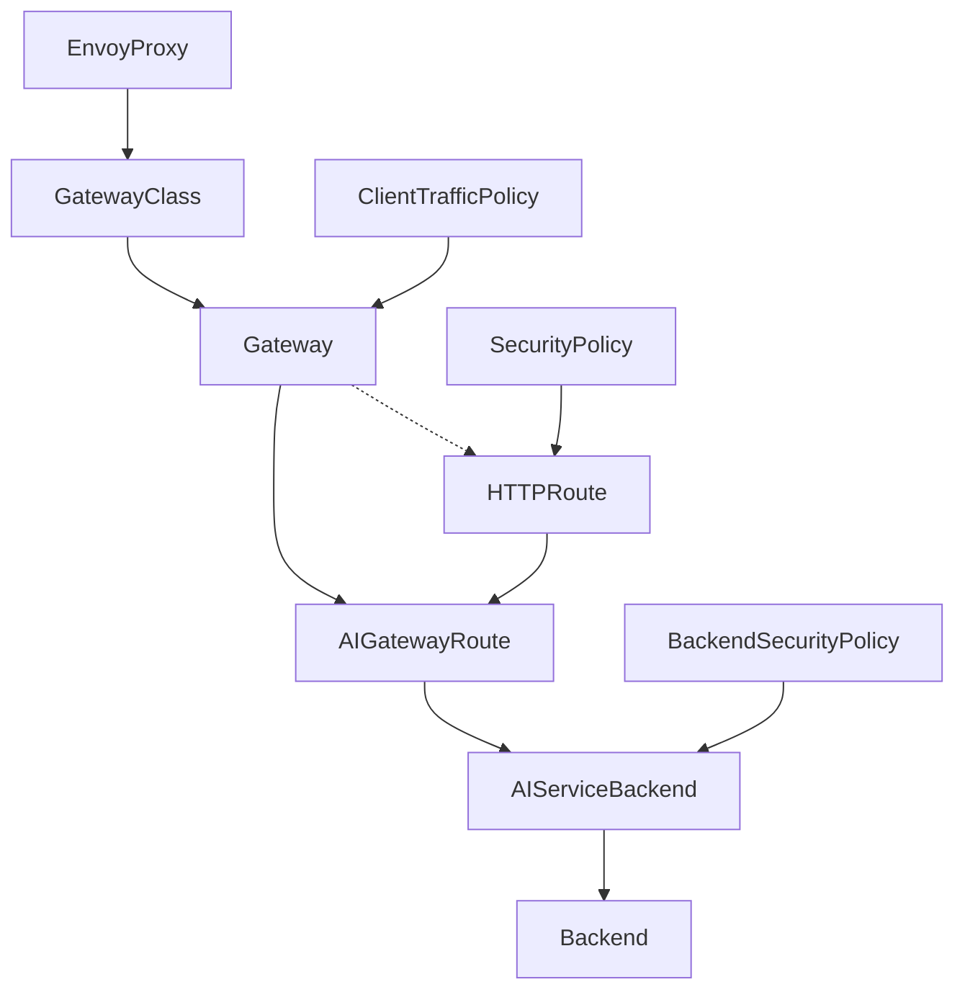

:::caution
This page contains administrative documentation intended for cluster administrators and operators. This content may not be relevant for regular users.
:::

:::caution
When changing the provided models, also change the [Chatbox config template](https://gitlab.nrp-nautilus.io/prp/nrp-site/-/blob/main/src/components/vue/LLMToken.vue).
:::


## Envoy AI Gateway Management

This document describes the steps to configure the [Envoy AI Gateway](https://aigateway.envoyproxy.io).



## Gitlab Project

The (hopefully) current configuration is in https://gitlab.nrp-nautilus.io/prp/llm-proxy project. You most likely will only need to edit the stuff in models-config folder. Everything else is either other experiments or core config that doesn't have to change.

:::caution
The CRDs are pretty complex. Instead of directly editing the cluster objects, please edit the local files and do `kubectl apply -f <file>` after examining the changes to be made (`kubectl diff -f <file>`). This will ensure your local content is the same as remote.
:::

Push back your changes to git when you're done.

Since we need to handle objects deletions too, we can't add those to GitLab CI/CD yet.

## CRDs Structure

### AIGatewayRoute

The top object is [AIGatewayRoute](https://aigateway.envoyproxy.io/docs/api/#aigatewayroute), referencing the `Gateway` that you don't need to change.

Current AIGatewayRoutes are in https://gitlab.nrp-nautilus.io/prp/llm-proxy/-/tree/main/models-config/gatewayroute, and are split into several objects because there's a limit of 16 routes (rules) per object. Start from adding your new model as a new rule. Note that we're overriding the long names of the models with shorter ones using the [modelNameOverride feature](https://aigateway.envoyproxy.io/blog/v0.3-release-announcement#model-name-virtualization-abstraction-for-flexibility).

On this level, you can also set up load-balancing between multiple models. Having several [backendRefs](https://aigateway.envoyproxy.io/docs/api/#aigatewayrouterulebackendref) will make Envoy round-robin between those. There's also a way to set priority and fallbacks (which currently [have a regression](https://github.com/envoyproxy/ai-gateway/pull/1322)).

**Make sure to delete the `rules:` and update the `AIGatewayRoute` with `kubectl apply -f <file>` if a model is removed. If all models under `rules:` were deleted, make sure to delete the `AIGatewayRoute` resource manually.**

Example (under https://gitlab.nrp-nautilus.io/prp/llm-proxy/-/tree/main/models-config/gatewayroute):

```yaml
apiVersion: aigateway.envoyproxy.io/v1alpha1
kind: AIGatewayRoute
metadata:
  name: envoy-ai-gateway-nrp-qwen
  namespace: nrp-llm
spec:
  llmRequestCosts:
    - metadataKey: llm_input_token
      type: InputToken    # Counts tokens in the request
    - metadataKey: llm_output_token
      type: OutputToken   # Counts tokens in the response
    - metadataKey: llm_total_token
      type: TotalToken   # Tracks combined usage
  parentRefs:
    - name: envoy-ai-gateway-nrp
      kind: Gateway
      group: gateway.networking.k8s.io
  rules:
    - matches:
        - headers:
            - type: Exact
              name: x-ai-eg-model
              value: qwen3
      backendRefs:
        - name: envoy-ai-gateway-nrp-qwen
          modelNameOverride: Qwen/Qwen3-235B-A22B-Thinking-2507-FP8
      timeouts:
        request: 1200s
      modelsOwnedBy: "NRP"
    - matches:
        - headers:
            - type: Exact
              name: x-ai-eg-model
              value: qwen3-nairr
      backendRefs:
        - name: envoy-ai-gateway-sdsc-nairr-qwen3
          modelNameOverride: Qwen/Qwen3-235B-A22B-Thinking-2507-FP8
      timeouts:
        request: 1200s
      modelsOwnedBy: "SDSC"
    # Multiple backendRefs do round-robin
    - matches:
        - headers:
            - type: Exact
              name: x-ai-eg-model
              value: qwen3-combined
      backendRefs:
        - name: envoy-ai-gateway-nrp-qwen
          modelNameOverride: Qwen/Qwen3-235B-A22B-Thinking-2507-FP8
        - name: envoy-ai-gateway-sdsc-nairr-qwen3
          modelNameOverride: Qwen/Qwen3-235B-A22B-Thinking-2507-FP8
      timeouts:
        request: 1200s
      modelsOwnedBy: "NRP"
```

Start defining the [AIServiceBackend](https://aigateway.envoyproxy.io/docs/api/#aiservicebackend) next.

### AIServiceBackend

Add your [AIServiceBackend](https://aigateway.envoyproxy.io/docs/api/#aiservicebackend) to one of the files in https://gitlab.nrp-nautilus.io/prp/llm-proxy/-/tree/main/models-config/servicebackend.

**Make sure to delete the `AIServiceBackend` resource manually if a model is removed.**

Example (under https://gitlab.nrp-nautilus.io/prp/llm-proxy/-/tree/main/models-config/servicebackend):

```yaml
apiVersion: aigateway.envoyproxy.io/v1alpha1
kind: AIServiceBackend
metadata:
  name: envoy-ai-gateway-nrp-qwen
  namespace: nrp-llm
spec:
  schema:
    name: OpenAI
  backendRef:
    name: envoy-ai-gateway-nrp-qwen
    kind: Backend
    group: gateway.envoyproxy.io
```

Continue to defining the [Backend](https://gateway.envoyproxy.io/docs/api/extension_types/#backend).

### Backend

:::note
This object belongs to the Envoy Gateway API and not Envoy AI Gateway API.
:::

Add your [Backend](https://gateway.envoyproxy.io/docs/api/extension_types/#backend) to one of the files in https://gitlab.nrp-nautilus.io/prp/llm-proxy/-/tree/main/models-config/backend.

You can point it to a URL (either a service inside the cluster or a FQDN), or an IP.

**Make sure to delete the `Backend` resource manually if a model is removed.**

Example (under https://gitlab.nrp-nautilus.io/prp/llm-proxy/-/tree/main/models-config/backend):

```yaml
apiVersion: gateway.envoyproxy.io/v1alpha1
kind: Backend
metadata:
  name: envoy-ai-gateway-nrp-qwen
  namespace: nrp-llm
spec:
  endpoints:
    - fqdn:
        hostname: qwen-vllm-inference.nrp-llm.svc.cluster.local
        port: 5000
```

### BackendSecurityPolicy

If your model has a newly added API access key, you can add a [BackendSecurityPolicy](https://aigateway.envoyproxy.io/docs/api/#backendsecuritypolicy) to https://gitlab.nrp-nautilus.io/prp/llm-proxy/-/blob/main/models-config/securitypolicy.yaml. It will point to an existing secret in the cluster containing your ApiKey.

It's easier if you reuse one of existing keys and simply add your backend to the list in one of existing BackendSecurityPolicies. The `BackendSecurityPolicy` should target an existing AIServiceBackend.

**Make sure to delete the `targetRefs:` section and update the `BackendSecurityPolicy` with `kubectl apply -f <file>` if a model is removed. Make sure to delete the `BackendSecurityPolicy` resource manually if all models under `targetRefs:` are removed.**

Example (under https://gitlab.nrp-nautilus.io/prp/llm-proxy/-/blob/main/models-config/securitypolicy.yaml):

```yaml
apiVersion: aigateway.envoyproxy.io/v1alpha1
kind: BackendSecurityPolicy
metadata:
  name: envoy-ai-gateway-nrp-apikey
  namespace: nrp-llm
spec:
  type: APIKey
  apiKey:
    secretRef:
      name: openai-apikey
      namespace: nrp-llm
  targetRefs:
    - name: envoy-ai-gateway-nrp-qwen
      kind: AIServiceBackend
      group: aigateway.envoyproxy.io
```

### Chatbox Template

Finally, update the [Chatbox Config Template](https://gitlab.nrp-nautilus.io/prp/nrp-site/-/blob/main/src/components/vue/LLMToken.vue).

## vLLM/SGLang Instructions

### Core instructions

The below are the set of example resources required to deploy an LLM model on the `nrp-llm` namespace (similar in the `sdsc-llm` namespace, but check the `StatefulSet` or `Deployment` examples within the namespace for differences):

StatefulSet (Recommended):

```yaml
apiVersion: apps/v1
kind: StatefulSet
metadata:
  labels:
    app: minimax-vllm-inference
  name: minimax-vllm-inference
  namespace: nrp-llm
spec:
  persistentVolumeClaimRetentionPolicy:
    whenDeleted: Retain
    whenScaled: Retain
  podManagementPolicy: OrderedReady
  replicas: 1
  selector:
    matchLabels:
      app: minimax-vllm-inference
  serviceName: minimax-vllm-inference
  template:
    metadata:
      labels:
        app: minimax-vllm-inference
    spec:
      affinity:
        nodeAffinity:
          requiredDuringSchedulingIgnoredDuringExecution:
            nodeSelectorTerms:
            - matchExpressions:
              # Specify when requiring specific GPUs but not for designated special GPUs such as `nvidia.com/a100` or `nvidia.com/rtxa6000`
              #- key: nvidia.com/gpu.product
              #  operator: In
              #  values:
              #  - NVIDIA-L40
              # In smaller models under 80GB, just setting `nvidia.com/gpu.memory` should be enough unless requiring specific GPU generations; in such cases, use `nvidia.com/gpu.compute.major` or `nvidia.com/gpu.compute.minor`, which defines the CUDA GPU Compute Capability
              - key: nvidia.com/gpu.memory
                operator: Gt
                values:
                - "80000"
              # E.g., Greater Than 565 (>=570) for CUDA 12.8 or 12.9, Greater Than 575 (>=580) for CUDA 13.0
              - key: nvidia.com/cuda.driver.major
                operator: Gt
                values:
                - "565"
      containers:
      - args:
        # Refer to the documentation for detailed setup
        - |
          python3 -m vllm.entrypoints.openai.api_server --port 5000 --host 0.0.0.0 --download-dir /workspace/.cache/huggingface/hub --model MiniMaxAI/MiniMax-M2.5 --tensor-parallel-size 4 --trust-remote-code --enable-chunked-prefill --enable-prefix-caching --max-num-seqs 128 --gpu-memory-utilization 0.95 --max-model-len 262144 --hf-overrides '{"max_position_embeddings": 262144, "rope_scaling": {"type": "dynamic", "factor": 1.5, "original_max_position_embeddings": 196608}}' --enable-auto-tool-choice --tool-call-parser minimax_m2 --reasoning-parser minimax_m2
        command:
        - bash
        - -c
        env:
        # Add environment variables when the Hugging Face or vLLM documentation specifies as beneficial
        #- name: SAFETENSORS_FAST_GPU
        #  value: "1"
        envFrom:
        - configMapRef:
            # Default configMap for nrp-llm, refer to other models for sdsc-llm
            name: qwen-vllm-inference-config
        # Use nightly container when recent commit fixes model or tool calling
        image: vllm/vllm-openai:v0.17.0
        name: minimax-vllm-inference
        ports:
        - containerPort: 5000
          name: http
          protocol: TCP
        resources:
          limits:
            # Multiply 2 to the number of GPUs and add 2; Set maximum possible if offloading to CPU RAM
            cpu: "10"
            # At least the model size
            memory: 360Gi
            # VRAM >= Model weight size in https://pypi.org/project/hf-mem/ + KV cache when fully on VRAM
            nvidia.com/a100: "4"
          requests:
            # Multiply 2 to the number of GPUs and add 2; Set maximum possible if offloading to CPU RAM
            cpu: "10"
            # Around half of the model size or whatever lesser amount the intended node can fit; more than half for multimodal models
            memory: 160Gi
            # VRAM >= Model weight size in https://pypi.org/project/hf-mem/ + KV cache when fully on VRAM
            nvidia.com/a100: "4"
        securityContext:
          allowPrivilegeEscalation: false
          capabilities:
            drop:
            - ALL
          runAsNonRoot: false
        volumeMounts:
        - mountPath: /dev/shm
          name: shm
        - mountPath: /workspace/.cache
          name: minimax-inference-volume
          subPath: cache
      priorityClassName: owner
      securityContext:
        runAsGroup: 0
        runAsNonRoot: false
        runAsUser: 0
      tolerations:
      - effect: NoSchedule
        key: nautilus.io/reservation
        value: nrp-llm
      - effect: PreferNoSchedule
        key: nvidia.com/gpu
        operator: Exists
      # Only set this when using 4 or 8 GPUs, not any other count such as 1, 2, or 6
      #- effect: NoSchedule
      #  key: nautilus.io/hardware
      #  operator: Equal
      #  value: large-gpu
      volumes:
      - emptyDir:
          medium: Memory
          sizeLimit: 10995116277760m
        name: shm
  volumeClaimTemplates:
  - apiVersion: v1
    kind: PersistentVolumeClaim
    metadata:
      name: minimax-inference-volume
    spec:
      accessModes:
      - ReadWriteOnce
      resources:
        requests:
          # 10-20% more than the model weight size in https://pypi.org/project/hf-mem/
          storage: 256Gi
      # May be linstor-unl if target node is in us-central or us-east, but use linstor-igrok over linstor-sdsu normally
      storageClassName: linstor-igrok
      volumeMode: Filesystem
---
apiVersion: v1
kind: Service
metadata:
  labels:
    component: llm
  name: minimax-vllm-inference
  namespace: nrp-llm
spec:
  ports:
  - name: http
    port: 5000
    protocol: TCP
    targetPort: 5000
  selector:
    app: minimax-vllm-inference
  type: ClusterIP
```

Deployment (Legacy, Should be ported to StatefulSet):

```yaml
apiVersion: apps/v1
kind: Deployment
metadata:
  name: minimax-vllm-inference
  namespace: nrp-llm
spec:
  replicas: 1
  selector:
    matchLabels:
      app: minimax-vllm-inference
  template:
    metadata:
      labels:
        app: minimax-vllm-inference
    spec:
      affinity:
        nodeAffinity:
          requiredDuringSchedulingIgnoredDuringExecution:
            nodeSelectorTerms:
            - matchExpressions:
              # Specify when requiring specific GPUs but not for designated special GPUs such as `nvidia.com/a100` or `nvidia.com/rtxa6000`
              #- key: nvidia.com/gpu.product
              #  operator: In
              #  values:
              #  - NVIDIA-L40
              # In smaller models under 80GB, just setting `nvidia.com/gpu.memory` should be enough unless requiring specific GPU generations; in such cases, use `nvidia.com/gpu.compute.major` or `nvidia.com/gpu.compute.minor`, which defines the CUDA GPU Compute Capability
              - key: nvidia.com/gpu.memory
                operator: Gt
                values:
                - "80000"
              # E.g., Greater Than 565 (>=570) for CUDA 12.8 or 12.9, Greater Than 575 (>=580) for CUDA 13.0
              - key: nvidia.com/cuda.driver.major
                operator: Gt
                values:
                - "565"
      containers:
      - args:
        # Refer to the documentation for detailed setup
        - |
          python3 -m vllm.entrypoints.openai.api_server --port 5000 --host 0.0.0.0 --download-dir /workspace/.cache/huggingface/hub --model MiniMaxAI/MiniMax-M2.5 --tensor-parallel-size 4 --trust-remote-code --enable-chunked-prefill --enable-prefix-caching --max-num-seqs 128 --gpu-memory-utilization 0.95 --max-model-len 262144 --hf-overrides '{"max_position_embeddings": 262144, "rope_scaling": {"type": "dynamic", "factor": 1.5, "original_max_position_embeddings": 196608}}' --enable-auto-tool-choice --tool-call-parser minimax_m2 --reasoning-parser minimax_m2
        command:
        - bash
        - -c
        env:
        # Add environment variables when the Hugging Face or vLLM documentation specifies as beneficial
        #- name: SAFETENSORS_FAST_GPU
        #  value: "1"
        envFrom:
        - configMapRef:
            # Default configMap for nrp-llm, refer to other models for sdsc-llm
            name: qwen-vllm-inference-config
        # Use nightly container when recent commit fixes model or tool calling
        image: vllm/vllm-openai:v0.17.0
        name: minimax-vllm-inference
        ports:
        - containerPort: 5000
          name: http
          protocol: TCP
        resources:
          limits:
            # Multiply 2 to the number of GPUs and add 2; Set maximum possible if offloading to CPU RAM
            cpu: "10"
            # At least the model size
            memory: 360Gi
            # VRAM >= Model weight size in https://pypi.org/project/hf-mem/ + KV cache when fully on VRAM
            nvidia.com/a100: "4"
          requests:
            # Multiply 2 to the number of GPUs and add 2; Set maximum possible if offloading to CPU RAM
            cpu: "10"
            # Around half of the model size or whatever lesser amount the intended node can fit; more than half for multimodal models
            memory: 160Gi
            # VRAM >= Model weight size in https://pypi.org/project/hf-mem/ + KV cache when fully on VRAM
            nvidia.com/a100: "4"
        securityContext:
          allowPrivilegeEscalation: false
          capabilities:
            drop:
            - ALL
          runAsNonRoot: false
        volumeMounts:
        - mountPath: /dev/shm
          name: shm
        - mountPath: /workspace/.cache
          name: minimax-inference-volume
          subPath: cache
      priorityClassName: owner
      securityContext:
        runAsGroup: 0
        runAsNonRoot: false
        runAsUser: 0
      tolerations:
      - effect: NoSchedule
        key: nautilus.io/reservation
        value: nrp-llm
      - effect: PreferNoSchedule
        key: nvidia.com/gpu
        operator: Exists
      # Only set this when using 4 or 8 GPUs, not any other count such as 1, 2, or 6
      #- effect: NoSchedule
      #  key: nautilus.io/hardware
      #  operator: Equal
      #  value: large-gpu
      volumes:
      - name: minimax-inference-volume
        persistentVolumeClaim:
          claimName: minimax-inference-volume
      - emptyDir:
          medium: Memory
          sizeLimit: 10995116277760m
        name: shm
---
apiVersion: v1
kind: PersistentVolumeClaim
metadata:
  name: minimax-inference-volume
  namespace: nrp-llm
spec:
  accessModes:
  - ReadWriteOnce
  resources:
    requests:
      # 10-20% more than the model weight size in https://pypi.org/project/hf-mem/
      storage: 256Gi
  # May be linstor-unl if target node is in us-central or us-east, but use linstor-igrok over linstor-sdsu normally
  storageClassName: linstor-igrok
  volumeMode: Filesystem
---
apiVersion: v1
kind: Service
metadata:
  labels:
    component: llm
  name: minimax-vllm-inference
  namespace: nrp-llm
spec:
  ports:
  - name: http
    port: 5000
    protocol: TCP
    targetPort: 5000
  selector:
    app: minimax-vllm-inference
  type: ClusterIP
```

In this case, the `Backend` for Envoy AI Gateway should be configured as `hostname: minimax-vllm-inference.nrp-llm.svc.cluster.local` and `port: 5000`.

Refer to the below instructions for configuring vLLM/SGLang and above instructions for configuring Envoy AI Gateway.

### How to load models into GPUs

1. Read individual instructions for each model (both from Hugging Face and vLLM/SGLang) carefully, and also check deployment configurations from other models. The recommended number of CPU cores to request is `2 * [number of GPUs] + 2`, and the recommended RAM size is `request: [slightly over half of total loaded model size]`, `limit: [slightly over total loaded model size]`.
2. Tune `--gpu-memory-utilization` to ideally fit enough KV cache that is larger than `--max-model-len`, but with enough space for CUDA graphs to be built. This is typically calculated outside `--gpu-memory-utilization`, so if the CUDA graph build stage errors with not enough memory, `--gpu-memory-utilization` has to be lowered. Moreover, some multimodal models may also consume more memory outside `--gpu-memory-utilization` for certain reasons. If there is an error about insufficient KV cache, `--gpu-memory-utilization` has to be increased, or if both errors occur, consult the next step.
3. Moreover, note that if the `num_key_value_heads` in `config.json` is lower than the `--tensor-parallel-size` (typically the number of GPUs in a simple configuration), KV cache is duplicated, reducing the context width available from vLLM. In multi-head latent attention (MLA) models like DeepSeek or Kimi, `num_key_value_heads` is always considered `1` even if `config.json` says otherwise. An initial solution is deduplicating the KV cache by: (1) only increasing `--tensor-parallel-size` until `num_key_value_heads`, then use `--pipeline-parallel-size` for the rest of the GPUs required to load the weights, or (2) to use Context Parallelism (`--decode-context-parallel-size`) so that the product (multiplication) of `--decode-context-parallel-size` and `num_key_value_heads` equals `--tensor-parallel-size`, especially in multi-head latent attention (MLA) models such as DeepSeek and Kimi families. Consult the detailed dedicated instructions for various types of parallelism below.
4. Do not use `--enforce-eager` unless absolutely necessary, as this cuts the token throughput into 1/4 to 1/6 in many cases. CUDA graphs lead to a substantial performance benefit. Using this should only happen if other efforts below have failed to achieve the designed context length of the model. An alternative is to use `--compilation-config "{\"cudagraph_mode\": \"PIECEWISE\"}"`, as this argument retains some level of CUDA graph capability while conserving VRAM, but the conservation is likely about half to one GB, and has visible token throughput sacrifices.
5. Tune `--max-num-seqs` first, before modifying the maximum context length (`--max-model-len`) anywhere below the full context. The initial priority is always to achieve the designed full context length of the model, so tune other parameters before changing `--max-model-len`. The `--mm-encoder-tp-mode`, `--mm-processor-cache-type`, and `--mm-processor-cache-gb` arguments may also be relevant for some multimodal models.
6. Test that the model works when a large part of the KV cache has been filled through the prompts. Some models may have volatile VRAM consumption during runtime and may get out-of-memory errors even after successful initialization.
7. Update the [Envoy Proxy configuration](#envoy-ai-gateway-management) above, and the [Chatbox config template](https://gitlab.nrp-nautilus.io/prp/nrp-site/-/blob/main/src/components/vue/LLMToken.vue).
8. Check if there are methods which improve throughput or increase KV cache capacity, including multi-token prediction (also called speculative decoding), including Context Parallelism (`--decode-context-parallel-size`), or Data Parallelism Attention + Expert Parallelism (`--enable-expert-parallel` with `--data-parallel-size` in vLLM or `--expert-parallel-size` and `--enable-dp-attention` in SGLang). More explanations are below.
9. Consider using `--kv-offloading-backend native --kv-offloading-size <size_in_GB>`, where more information is available in [KV Offloading Connector](https://blog.vllm.ai/2026/01/08/kv-offloading-connector.html). However, this is not a solution for when 1x full context does not fit within the KV cache of the GPU, and 1x full context should still fit inside the GPU KV cache regardless.

### Increasing Context Length with RoPE

RoPE (Rotary Position Embedding) allows expanding the context size beyond the default allowed by the model. For smaller factors (`max_position_embeddings / original_max_position_embeddings`), `dynamic` RoPE can be used. For larger factors, `yarn` RoPE could also be used, if the model supports this method. **Note that if there are separate instructions from the model, those instructions are prioritized**, and the format of `--hf-overrides` depends on the model's `config.json` file.

Example for [MiniMaxAI/MiniMax-M2.5](https://huggingface.co/MiniMaxAI/MiniMax-M2.5): `--max-model-len 262144 --hf-overrides '{"max_position_embeddings": 262144, "rope_scaling": {"type": "dynamic", "factor": 1.5, "original_max_position_embeddings": 202752}}'`

Example for [Qwen/Qwen3.5-397B-A17B-FP8](https://huggingface.co/Qwen/Qwen3.5-397B-A17B-FP8): `--max-model-len 1010000 --hf-overrides '{"text_config": {"max_position_embeddings": 1010000, "rope_parameters": {"mrope_interleaved": true, "mrope_section": [11, 11, 10], "rope_type": "yarn", "rope_theta": 10000000, "partial_rotary_factor": 0.25, "factor": 4.0, "original_max_position_embeddings": 262144}}}'`

### Miscellaneous Advice

- For deploying very new models with new architectures that cannot be inherited from a previous model generation, administrators would likely have to hunt through issues and pull request commits through GitHub, or in some cases, contribute changes themselves.
- The real-life experiences of agentic LLM models depend extremely heavily on tool calling and reasoning parser implementations. What was advertised to work in the provider's own API may not work or lead to disappointing outcomes in the model engines (vLLM/SGLang) because of tool calling and reasoning parsers. Problems in tool calling and reasoning parsers are easily over 75% of all previously experienced issues, and the remaining under 25% are mostly issues in model parallelism or the backend kernels.
- Model parallelism determines whether a model fits in the set of hardware we have, and how much KV cache we can extract from the hardware. This is the most important part of LLM deployment where we can control.
- [hf-mem](https://pypi.org/project/hf-mem/) is useful, but the KV cache estimate may be inaccurate. Assume that the KV cache is bfloat16 to be conservative. Something like `uvx hf-mem --model-id MiniMaxAI/MiniMax-M2.5 --experimental --max-model-len 262144 --batch-size 1 --kv-cache-dtype bfloat16` is an example that can be used.

### GPU Count Issue: Error with hidden/intermediate/block/... size division / Worker failed with error 'Invalid thread config'

Note: When there is an error about layer count divisibility or invalid configurations, this does not necessarily mean that the GPU is not compatible. Rather, it may be about the count of GPUs (because tensor parallelism needs a perfect division of the number of hidden/intermediate/block/... size).

This may be caused by all sorts of model architectural reasons, when the **count of GPUs are too large (like 8), too small (like 2), or unconventional (like 6), while using tensor parallelism**. This all depends on the model architecture, and may be resolved by the below instructions on model parallelism.

### Model Parallelism

Model parallelism is the most important concept in high-parameter multi-GPU/multi-node LLM inference. Different types of parallelism (data, tensor, pipeline, context/sequence) are frequently combined together as they are on different axes.

#### Tensor Parallelism

**Abstract:** Default within a single-node (in multi-node, the default is to combine tensor parallelism within a single-node to pipeline parallelism between different nodes). `--tensor-parallel-size` shards model weights equally to each GPUs, but will duplicate KV cache across GPUs if `--tensor-parallel-size` is larger than `num_key_value_heads` or always duplicate KV cache across GPUs in multi-had latent attention (MLA) models. KV cache duplication is solved by decode context parallelism or pipeline parallelism.

Tensor parallelism (`--tensor-parallel-size`) is the default method to use to load models into multiple GPUs within a single node with high-performance GPU interconnect or P2P (e.g., NVLink/XGMI). Some issues may be solved by specifying expert parallelism (`--enable-expert-parallel`) in addition to `--tensor-parallel-size`, where whole experts are allocated to different nodes. Refer to the next parts for details.

An issue with tensor parallelism is that the KV cache is duplicated to each GPU device with tensor parallelism when the number of `num_key_value_heads` in `config.json` is smaller than `--tensor-parallel-size` or when multi-head latent attention (MLA) is used, leading to decreased KV cache capacity and wasting VRAM space, unless context parallelism or pipeline parallelism is used to deduplicate the KV cache. Descriptions are in relevant sections.

#### Expert Parallelism

**Abstract:** When tensor parallelism (`--tensor-parallel-size`) is combined with expert parallelism (`--enable-expert-parallel` in vLLM, or the same `--expert-parallel-size` size as `--tensor-parallel-size` in SGLang) in an Mixture of Experts (MoE) model, the LLM engine (vLLM/SGLang) only shards dense attention layers within the model, and allocates whole expert layers into each GPU instead of sharding them.

For Mixture of Experts (MoE) models, tensor parallelism without expert parallelism shards all experts equally in each GPU, while tensor parallelism with expert parallelism loads different individual experts onto each GPU.

For instance, if each expert layer is considered a cube, all cubes are equally cut with a knife into the number of GPUs, and each cut piece of the cube is loaded to each GPU. Therefore, each GPU has one split of all expert layers of the model. The same happens and is the default for Dense models as well. But if expert parallelism is utilized, instead of cutting each cube with a knife, different individual whole cubes are loaded into each GPU. Dense attention layers are sharded like normal tensor parallelism either way, but this can be changed so that dense attention layers use data parallelism. Relevant descriptions are available in the section for data parallelism.

Tensor parallelism without expert parallelism ensures equal load to all GPUs, and tensor parallelism with expert parallelism may lead to GPU load imbalance when only specific experts are used, but may respond better to GPU interconnect bottlenecks. Token performance may be worse or better depending on the model or environment, so it may be preferable to omit this argument if the throughput is worse when enabled. However, expert parallelism may possibly improve the time to first token (TTFT), lead to improved performance when the model is loaded across multiple nodes, combined with data parallelism, or when the interconnect between GPUs is bottlenecked.

Expert parallelism load balancer (EPLB) is a technique to balance the load of expert parallelism within GPUs.

#### Context Parallelism

**Abstract:** Context parallelism shards and deduplicates the KV cache when there is duplication across GPUs. Decode context parallelism (`--decode-context-parallel-size`) is normally mandatory for multi-head latent attention (MLA) models and may benefit other models with lower `num_key_value_heads` values in `config.json` than `--tensor-parallel-size`. Prefill context parallelism (`--prefill-context-parallel-size`) deduplicates KV cache but duplicates model weights, thus being mostly ineffective for conserving VRAM for model weights. Other types of context parallelism methods such as Helix parallelism are gaining attention.

Decode context parallelism (`--decode-context-parallel-size`) is not needed in tensor parallelism when the model is not a multi-head latent attention (MLA) model **AND** `num_key_value_heads` in `config.json` is larger than or equal to `--tensor-parallel-size`, because each `num_key_value_heads` is distributed to each GPU. However, when `num_key_value_heads` becomes smaller than `--tensor-parallel-size` or when multi-head latent attention (MLA) models are used, you should use decode context parallelism (`--decode-context-parallel-size`) so that the product (multiplication) of `num_key_value_heads` (which is always `1` when MLA models are used regardless of `config.json`) and `--decode-context-parallel-size` becomes `--tensor-parallel-size`.

**NOTE**: Many LLM models have over 16 to 128 `num_key_value_heads`, but recently, models such as Qwen3.5 or GLM-4.7 only have 2-8 `num_key_value_heads`, which indicates that decode context parallelism should be used if available. Decode context parallelism should always be used for multi-head latent attention (MLA) models when available because where the KV cache is compressed into a lower-dimensional latent space, and the number of KV heads visible to the LLM engine (vLLM) decreases to `1` (especially in DeepSeek-V3/R1 series and derived models such as Kimi-K2). Therefore, `num_key_value_heads` in `config.json` larger than `--tensor-parallel-size` **does not** always mean that there won't be any duplicated KV cache, and any models using multi-head latent attention (MLA) should assume `num_key_value_heads` as being 1. The `use_mla` property in [`vllm/config/model.py`](https://github.com/vllm-project/vllm/blob/main/vllm/config/model.py) decides which model uses MLA.

Prefill context parallelism (`--prefill-context-parallel-size`) deduplicates KV cache but duplicates model weights, thus being mostly ineffective for conserving VRAM for model weights, but may have purposes for ultra-large-context models. Other types of context parallelism methods for ultra-large-context such as Helix parallelism, which shards the KV cache further beyond the constraints of decode context parallelism, are gaining attention.

#### Pipeline Parallelism

**Abstract:** Pipeline parallelism (`--pipeline-parallel-size`) is the default method when sharding model weights across multiple GPU nodes, where it is combined with tensor parallelism (`--tensor-parallel-size`) within GPUs of single nodes. It is also an alternative to decode context parallelism (`--decode-context-parallel-size`) for deduplicating KV cache when specific models do not have decode context parallelism implemented, only setting `--tensor-parallel-size` up to the `num_key_value_heads` in `config.json` and using `--pipeline-parallel-size` to shard both the model weights and KV cache further within a single node, or when the model fits within an unconventional number of GPUs (not in powers of two).

Combining pipeline parallelism (`--pipeline-parallel-size`) with tensor parallelism (`--tensor-parallel-size`) is an acceptable solution that works with unconventional GPU counts (not in powers of two), or when errors such as `Error with hidden/intermediate/block/... size division / Worker failed with error 'Invalid thread config', etc.` occur. An example is using 6 GPUs through `--tensor-parallel-size 2 --pipeline-parallel-size 3`, 8 GPUs using `--tensor-parallel-size 2 --pipeline-parallel-size 4`, or `--tensor-parallel-size 4 --pipeline-parallel-size 2`, due to pipeline parallelism tolerating uneven splits of layers.

Moreover, pipeline parallelism is an acceptable method for deduplicating KV cache when specific models do not have decode context parallelism implemented, where `--tensor-parallel-size` is only set until the `num_key_value_heads` in `config.json`, and using `--pipeline-parallel-size` to shard both the model weights and KV cache further within a single node. For example, in [Qwen/Qwen3.5-397B-A17B-FP8](https://huggingface.co/Qwen/Qwen3.5-397B-A17B-FP8), `num_key_value_heads` is `2` within `config.json` and the model is not multi-head latent attention (MLA). In this case, we can use `--tensor-parallel-size 2` so that `--tensor-parallel-size` is not larger than `num_key_value_heads`, and use `--pipeline-parallel-size 2` to load the model weights and shard the KV cache without duplication into a multiplied total of four GPUs.

However, pipeline parallelism has some non-negligible VRAM overhead and may lead to suboptimal performance. But on contrary, pipeline parallelism using GPUs inside a single node **that lacks** high-performance interconnects (e.g., NVLink/XGMI) or utilizing consumer GPUs **without** P2P communication may lead to better performance than on tensor parallelism. This may be the case especially in consumer GPUs without HBM memory, but not necessarily professional (e.g., Quadro, RTX Pro) GPUs, and most likely not in datacenter (e.g., A100, H200, B100) GPUs.

Similar to tensor parallelism, expert parallelism (`--enable-expert-parallel`) may be added as adequate if the configuration without the argument does not work, but first trying without expert parallelism enabled is recommended.

Pipeline parallelism is the recommended and default way to shard models across multiple nodes when the model weights and KV cache do not fit in a single node, but unless specified in conditions above, people should prefer tensor parallelism within single nodes with a high-performance interconnect.

#### Data Parallelism

**Abstract**: Data parallelism (`--data-parallel-size`), in its original design, duplicates model weights across GPUs to increase token throughput and instance capacity. However, it is useful in Mixture of Experts (MoE) models combining expert parallelism (`--enable-expert-parallel` in vLLM, or `--expert-parallel-size` in SGLang), where each whole expert layer can be placed in different GPUs, and only duplicates dense attention layers.

Data parallelism (`--data-parallel-size`), in its original design, has the most VRAM overhead, due to copying all of the same weights and layers redundantly across different GPUs, instead of sharding and dispersing weights across multiple GPUs. Data parallelism typically leads to an improvement in throughput when there are GPUs or nodes to spare, and is also able to combine with tensor parallelism or pipeline parallelism. But in essence, data parallelism does not assist in reducing VRAM consumption by sharding model weights, only increasing throughput by investing more computational resources.

**Expert Parallelism with Data Parallelism Attention**: However, expert parallelism (`--enable-expert-parallel`) makes data parallelism relevant for distributing models across multiple GPUs. As explained in the expert parallelism section, expert parallelism allows different GPUs to load different whole expert layers instead of all GPUs loading the same layers. In such cases, only the dense attention layers are duplicated across GPUs, reducing the redundancy of weights in an Mixture of Experts (MoE) model.

Mixture of Experts (MoE) models with data parallelism attention may reduce KV cache consumption (`--enable-expert-parallel` with `--data-parallel-size` in vLLM or `--enable-dp-attention` with `--expert-parallel-size` in SGLang), possibly utilizing KV cache more efficiently compared to other parallelism options while likely providing higher concurrent token throughput. However, because dense attention layers are still duplicated redundantly across multiple GPUs due to data parallelism, more VRAM is likely consumed, possibly defeating the goal of reducing KV cache consumption unless VRAM is sufficient.

External load balancing using expert parallelism load balancers (EPLB) through an external router, such as the Envoy AI Gateway, combined with data parallelism and expert parallelism, has a good potential to balance performance improvements and provide better KV cache capacity through inter-instance coordination through RPC communication in large-scale deployments.

Further reading:
- https://docs.vllm.ai/en/latest/configuration/engine_args/
- https://docs.vllm.ai/en/latest/serving/parallelism_scaling/
- https://docs.vllm.ai/en/latest/serving/expert_parallel_deployment/
- https://docs.vllm.ai/en/latest/serving/context_parallel_deployment/
- https://rocm.blogs.amd.com/software-tools-optimization/vllm-moe-guide/README.html
- https://rocm.docs.amd.com/en/docs-7.1.0/how-to/rocm-for-ai/inference-optimization/vllm-optimization.html
- https://akashsahani2001.medium.com/the-llm-scaling-hierarchy-mastering-every-dimension-of-parallelism-67937ae1d78e
- https://github.com/vllm-project/vllm/issues/10142
- https://github.com/vllm-project/vllm/issues/22821
- https://github.com/vllm-project/vllm/issues/28278
- https://github.com/vllm-project/vllm/issues/5951
- https://github.com/vllm-project/vllm/issues/17569
- https://github.com/vllm-project/vllm/issues/4232
