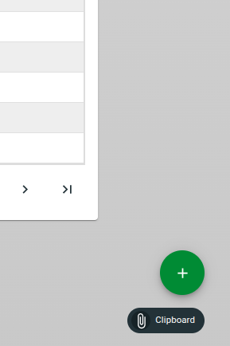
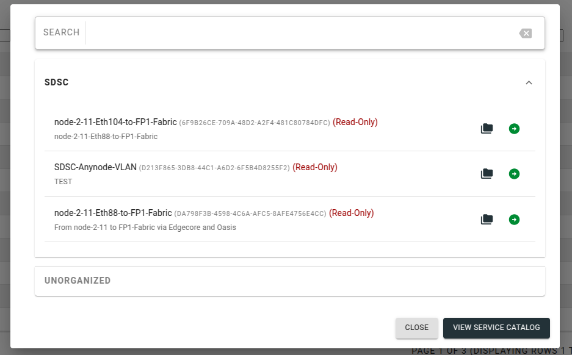
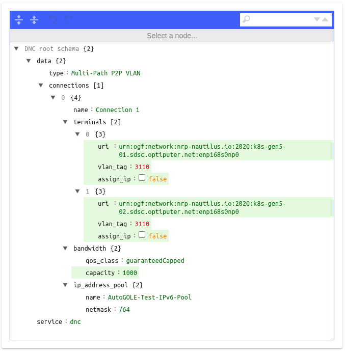
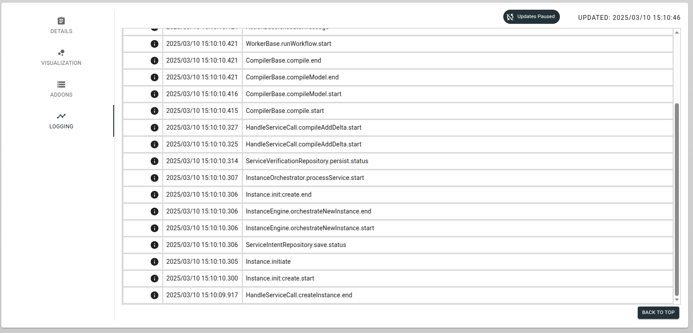

:::caution
This page contains administrative documentation intended for cluster administrators and operators. This content may not be relevant for regular users.
:::


Follow these steps to provision an L2 path using SENSE and Multus.

:::note
Before starting, make sure you have access to the Sense Orchestrator either on [sense-o](https://sense-o.es.net:8443/StackV-web/portal/) or [sense-o-dev](https://sense-o-dev.es.net:8443/StackV-web/portal/). If you don't have access, please request access from [sense-info@es.net](mailto:sense-info@es.net).
:::

## Step 1: Create the SENSE path:

Login into the orchestrator's online portal at [sense-o](https://sense-o.es.net:8443/StackV-web/portal/) or [sense-o-dev](https://sense-o-dev.es.net:8443/StackV-web/portal/) (Credentials provided by ESnet).

#### Create a new instance from the "+" button in the bottom right corner.



#### Select the service profile you want. (These will be provided and already populated by the ESnet SENSE Team).



#### Fill in the fields specifying the configuration for the L2 path you want. (You can view and search for URIs in the `Visualization` tab).



`uri`: The node's Uniform Resource Identifier. Can be looked up in search. Will contain the NRP node name and corresponding NIC interface in the name. Example: `urn:ogf:network:nrp-nautilus.io:2020:node-2-7.sdsc.optiputer.net:enp65s0f1np1`.

`assign_ip`: Whether or not the orchestrator should assign IPs.

`vlan_tag`: Can be any VLAN that doesn't already have a path on it. If the user specifies `any`, the orchestrator will pick an available VLAN tag.

`bandwidth.capacity`: QoS bandwidth and **not** an upper cap.

#### Specify an alias for the instance (name).


#### You can view the status (failure/success) and logs after hitting submit.



## Step 1A (Extra): Using the API

You can also acheieve the same results using the [sense-o-api](https://pypi.org/project/sense-o-api/), or the [sense-o-py-client](https://github.com/sdn-sense/sense-o-py-client/).

A detailed step-by-step guide on using the Python client can be found [here](/SENSE.pdf).

## Step 2: Configure the Node

You will see the interface(s) show up on the node(s) specified in the URI(s). Example:

```bash
nautilus@node-2-7:~$ ifconfig | grep -i vlan
vlan.3110: flags=4163<UP,BROADCAST,RUNNING,MULTICAST>  mtu 9000
vlan.3110-ifb: flags=195<UP,BROADCAST,RUNNING,NOARP>  mtu 1500
```
No further configuration on the node is necessary.

## Step 3: Create a Multus NetworkAttachmentDefinition
Define a Multus `NetworkAttachmentDefinition` using the MACVLAN interface. Save the following YAML as `network.yaml`:

```yaml
apiVersion: "k8s.cni.cncf.io/v1"
kind: NetworkAttachmentDefinition
metadata:
  name: macvlan-network
  namespace: <namespace>
spec:
  config: '{
    "cniVersion": "0.3.1",
    "type": "macvlan",
    "master": "vlan.3110",
    "mode": "bridge",
    "ipam": {
      "type": "host-local",
      "subnet": "192.168.1.0/24",
      "rangeStart": "192.168.1.1",
      "rangeEnd": "192.168.1.50"
    }
  }'
```

Apply it:

```bash
kubectl apply -f network.yaml
```

## Step 4: Create a Pod
Deploy a pod using the network. Save the following YAML as `pod.yaml`:

```yaml
apiVersion: v1
kind: Pod
metadata:
  name: macvlan-pod
  namespace: <namespace>
  annotations:
    k8s.v1.cni.cncf.io/networks: macvlan-network
spec:
  containers:
  - name: test-container
    image: alpine
    command: ["sh", "-c", "sleep 3600"]
    resources:
      limits:
        memory: "256Mi"
        cpu: "500m"
      requests:
        memory: "128Mi"
        cpu: "250m"
```

Apply it:

```bash
kubectl apply -f pod.yaml
```

## Step 5: Verify Connectivity
1. Exec into the pod:

```bash
kubectl exec -it macvlan-pod -n <namespace> -- sh
```

2. Test connectivity using `ping`, `iperf` or other tools.
